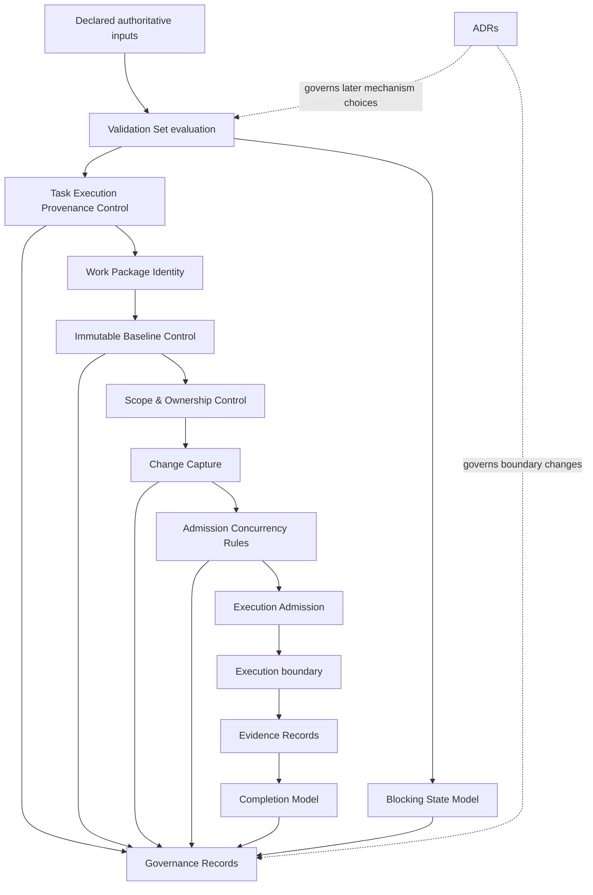

> **Public documentation:** This document is a technology-neutral, reusable publication of the Agentic SDLC Governance Core v1.0.0 handoff. It defines governance semantics and review obligations; it does not authorize application implementation.

# Agentic SDLC Governance Core — Architecture Handoff Document v1.0

> **Status:** Architecture Handoff v1.0 derived from the accepted Requirements Freeze  
> **Governed feature:** `Agentic_SDLC_Governance_Core`  
> **Authority:** [`requirements.md`](./requirements.md) is the sole frozen requirements reference.

**Authorized Requirements Freeze revision:** The handoff incorporates the explicit hybrid identity scope revision: stable `Work_Package_Identity` plus a unique, non-reusable `Attempt_Identity` for each actual execution attempt. Validation/replay does not allocate an attempt; retry/rerun does. Derivation, representation, allocation, persistence, and storage remain open future decisions.

## Overview

This v1.0 document is the formal architecture handoff for the frozen `Agentic_SDLC_Governance_Core` requirements. It defines semantic control boundaries and verification obligations while leaving implementation mechanisms open for later reviewed decisions.

## Executive Summary

The Agentic SDLC Governance Core is a fail-closed governance capability for agentic SDLC Work_Packages. It makes work admissible, attributable, bounded, auditable, concurrency-aware, and completion-ready only when declared authority, scope, ownership, identity, baseline, policy, provenance, and evidence can be verified together.

This document converts the frozen requirements into an architecture handoff contract. It defines the logical control boundaries, decision inputs, immutable records, blocking behavior, deterministic identity and concurrency rules, and verification obligations that a later architecture may refine. It deliberately does **not** select frameworks, classes, databases, queues, locks, schemas, APIs, deployment mechanisms, providers, models, or concrete repository paths.

A later design is ready to proceed only when every selected mechanism is traceable to this handoff and every unresolved mechanism remains an explicit future decision or approved ADR. No application-code change, Git-state change, existing-specification change, protected-task change, runtime-record change, or unrelated-domain change is part of this handoff.

## Problem Statement

Agentic SDLC work can proceed or claim completion without a reviewable chain from authority to bounded execution and evidence. The governed failure modes are:

- incomplete, stale, contradictory, ambiguous, or unverifiable authority;
- decisions inferred from omissions, repository convention, process identity, timing, or collection order;
- silent mutation of accepted authority or baseline facts;
- scope drift and duplicate or conflicting semantic ownership;
- uncontrolled overlap, invented serialization, or conflicting concurrent work;
- records or evidence attached to the wrong Work_Package_Identity;
- completion claims substituted for current, sufficient, attributable evidence;
- partial outcomes exposed when a required validation or immutable record cannot be trusted.

The Core addresses these conditions as governance decisions, not as a task runner, UI, provider integration, persistence product, or automatic policy inventor. The required result is a reviewable decision graph in which unsafe or unresolved conditions block the affected boundary while preserving unrelated valid work and the last prior safe state when one exists.

## Core Principles

### Fail Closed

The Core evaluates the complete applicable `Validation_Set` before finalizing a decision. Missing, ambiguous, contradictory, stale, invalid, or unverifiable authority, scope, ownership, identity, provenance, baseline, policy, concurrency, or evidence produces a named `Blocking_State` or rejection. A blocked, rejected, or quarantined outcome is never readiness, authorization, execution permission, progression, or completion.

Fail-closed behavior is boundary-specific: it withholds the affected outcome and every dependent outcome, freezes affected dependency relations when required, and preserves independently valid outcomes outside the affected boundary.

### No Inference

The Core consumes declared, attributable authority only. It never fills an absent fact from repository convention, process identity, timing, collection order, an unapproved override, a completion claim, or a plausible interpretation. If a fact is not declared or cannot be interpreted safely, the absence or ambiguity is itself a reviewable blocking reason.

### Immutable Authority

Accepted authority and baseline facts are append-only facts. A later material difference is represented by an immutable `Change_Record`, a new authoritative record, a new lifecycle version, or a linked successor decision as applicable. Corrections and supersession are linked records; they are not in-place rewrites.

### Provenance Is Part of Meaning

A governed fact, decision, record, evidence item, and outcome is incomplete without its authority reference, source version, timestamp, integrity reference, and attributable actor or process. Partial or unverifiable provenance cannot satisfy a governance condition.

### One Meaning, One Owner

Each defined governance meaning or decision has exactly one attributable `Semantic_Owner`. Composition references an existing owner; it does not duplicate or redefine the owned meaning. Conflicting ownership claims block the affected decision boundary.

### Deterministic Evaluation

Equivalent authoritative inputs produce equivalent identity, status, stable reason, governed boundary, provenance bindings, admission, blocking, concurrency, evidence, completion, and record content. Collection order, replay timing, process identity, and completion order are not decision inputs unless explicitly declared as authoritative facts.

## Architecture

### Logical Control Plane

The architecture is a logical control plane around a Work_Package lifecycle. It is intentionally independent of transport, storage, deployment, and UI mechanisms.



The arrows describe information and decision dependency, not a required runtime topology. A later architecture may distribute or combine these logical responsibilities only if it preserves their semantic ownership, immutable boundaries, provenance, fail-closed behavior, and recordability.

### Decision Lifecycle

1. **Declare:** receive the Work_Package, authoritative inputs, requested outcome, completion conditions, relations, and provenance declarations.
2. **Bind identity:** assign or validate exactly one stable `Work_Package_Identity` and lifecycle version.
3. **Validate:** evaluate the complete `Validation_Set`; do not finalize from a partial subset.
4. **Baseline:** capture accepted authority, scope, owner, identity, policy references, and acceptance provenance immutably.
5. **Admit or block:** produce one attributable `Decision_Outcome`, or create a named blocking state and withhold the dependent outcome.
6. **Observe and capture:** compare material observations with the accepted baseline and record attributable changes.
7. **Re-evaluate:** after an affecting change or resolved block, evaluate current authoritative inputs again; never resume by inference.
8. **Complete or block:** evaluate all declared completion conditions against current, sufficient, identity-bound evidence.
9. **Record:** create an immutable Governance_Record for each governed authority, admission, block, change, evidence, concurrency, review, or completion outcome.

### Lifecycle, Blocking, Re-evaluation, and Atomicity Contract

This contract defines the semantic lifecycle of a governed Work_Package. The lifecycle labels below are governance states and transition guards, not an implementation enum, workflow engine, persistence schema, or runtime topology. A later design MAY represent them differently only if it preserves the same ordering, bindings, failure behavior, and immutable history.

#### Lifecycle phases and transition guards

| Phase | Required entry facts | Permitted transition and guard | Failure behavior |
|---|---|---|---|
| **Declare** | Work_Package request, requested outcome, complete declared authority/scope/ownership inputs, completion-condition declaration, applicable relations, and provenance declarations. | Enter identity binding only when the declaration is attributable and its governed boundary is explicit. An absent completion-condition declaration is retained as an explicit absence and blocks completion; it is not inferred. | Reject or create a named block for the exact boundary. Preserve any prior safe state and expose no dependent outcome. |
| **Identity** | Exactly one stable `Work_Package_Identity`, its identity-defining facts, and lifecycle version; an actual execution intent is separately classified when applicable. | Enter validation only after the parent identity and lifecycle version are bound. Allocate exactly one non-reusable `Attempt_Identity` only for an admitted actual execution intent, with exact parent/version binding. | Identity assignment, lifecycle determination, intent classification, attempt allocation, binding, uniqueness, or non-reuse failure fails the whole affected operation. No identity-less Work_Package, partial attempt, or dependent outcome is accepted. |
| **Validate** | Complete applicable `Validation_Set`, including negative, contradictory, stale, and unverifiable findings and all material-input references. | Enter baseline or a decision only after every applicable check is evaluated and the result is attributable. Validation, inspection, and replay preserve prior identity/attempt references and allocate no attempt. | Any missing, ambiguous, contradictory, stale, or unverifiable state creates or retains a block and withholds every dependent outcome. No value is inferred or substituted. |
| **Baseline** | Accepted authority, `Scope_Boundary`, `Semantic_Owner`, identity/version, policy references, acceptance provenance, and integrity references. | Capture one immutable `Baseline` before admission or any dependent progression. | Incomplete or unverifiable capture blocks admission, completion, and dependent progression. Accepted facts are never mutated to make capture succeed. |
| **Admit or block** | Validated baseline, declared policy and concurrency results, exact identity binding, and complete provenance. | Produce one attributable admission `Decision_Outcome` for the exact boundary, or one named `Blocking_State` when a required condition is not satisfied. A non-success outcome never authorizes work. | If the outcome or its required immutable record cannot be preserved, neither is accepted; the affected operation halts and the prior safe state remains authoritative. |
| **Observe/change** | An attributable observation compared with the accepted authority or baseline. | Preserve accepted facts and append one immutable `Change_Record` for each material difference, including affected scope and impact determination. | An unattributable, incomparable, or unclassified change freezes the affected dependency boundary and blocks affected progression. Unrelated valid boundaries remain unchanged unless an authoritative relation connects them. |
| **Re-evaluate** | An affecting `Change_Record`, an attributable block resolution, or another explicitly authorized current evaluation trigger. | Evaluate the complete current `Validation_Set` again against current authority, baseline/version, scope, relations, evidence, and record-preservation requirements. A prior admission or completion result is not silently resumed. | If the new evaluation is incomplete or unsafe, retain/create the block and withhold affected outcomes. Resolution or elapsed time alone never restores permission. |
| **Complete or block** | Exact Work_Package identity, applicable immutable baseline, every explicitly declared completion condition, current and sufficient bound evidence, and complete provenance. | Accept completion only when every condition is satisfied and one completion outcome plus its Governance_Record is preserved. Otherwise create/retain a completion block. | Missing, stale, contradictory, unverifiable, misbound, or insufficient evidence blocks completion; a completion claim cannot become evidence. |
| **Record** | The accepted outcome, block, change, evidence, review, concurrency decision, or completion decision and all required references. | Preserve exactly one immutable `Governance_Record` for each governed outcome, linked to corrections, resolutions, supersessions, and related records as applicable. | Missing, invalid, unverifiable, or non-preservable record content prevents acceptance of the outcome and halts the affected operation; no partial record implies success. |

A transition is valid only when its entry facts, exact identity/boundary, lifecycle version, authority, provenance, and required related records are all verifiable. A later transition MUST NOT rewrite an earlier accepted phase. A material identity-defining change starts a new lifecycle version or governed identity under the accepted identity rule, while preserving the prior identity, attempts, baseline, outcomes, and records.

#### Blocking contract and affected-scope freeze

A `Blocking_State` is the explicit fail-closed result for a named unsafe or unresolved transition. It MUST contain the exact `Work_Package_Identity`, `Attempt_Identity` and parent/version when attempt-specific, or explicitly governed shared boundary; blocked outcome category; stable reason; triggering condition; authority and provenance references; required resolution condition; lifecycle status; and linked resolution/fresh-evaluation references when applicable. The existing `Blocking_State` catalogue contract is authoritative for field meaning and cardinality.

While a block is active or retained, the Core MUST withhold the admission, progression, execution, completion, or other outcome named by the block and every dependent outcome. A block MUST NOT be represented as readiness, authorization, evidence sufficiency, completion, or successful recovery. If the condition affects a shared authority, scope, baseline, identity, concurrency, or other declared boundary, the Core MUST freeze the affected dependency graph and block every affected Work_Package or attempt named by that boundary. It MUST preserve independently valid outcomes and evidence outside the affected boundary when no authoritative relation connects them.

Block creation, activation, retention, and resolution are themselves governed outcomes. If a required block cannot be created, activated, retained, or immutably represented, the Core MUST halt every affected operation and MUST expose neither a partial block nor an outcome implying safe progression. If a resolution or its record cannot be preserved, the block remains active/retained and the halt remains in force. A nonexistent active block cannot be resolved.

#### Resolution and fresh re-evaluation contract

A block may be considered for resolution only when an active `Blocking_State` exists for the exact boundary. Resolution MUST be attributable to the required authority and evidence named by the block, MUST preserve the original block and the resolution as linked immutable records, and MUST identify the current evaluation boundary. Recording a resolution is not itself admission, authorization, progression, execution, evidence sufficiency, or completion.

After a valid resolution, the Core MUST run a fresh complete evaluation against current authoritative inputs. The fresh evaluation MUST include any changed authority, scope, ownership, identity/lifecycle version, baseline, policy, concurrency relation, evidence validity, and record-preservation state. It MUST not restore the prior result by inference, cached status, unchanged request, passage of time, process identity, or collection order. If any condition remains unsafe, the original block remains retained or a new named block is created with the prior safe state preserved. Only the resulting attributable decision can permit the next phase.

An affecting change follows the same fresh-evaluation rule before affected progression. The Core MUST preserve the accepted prior authority and baseline, freeze the affected scope while impact is unresolved, and re-evaluate admission, concurrency, evidence, and completion before allowing further affected progression. A change with no authoritative relation to an unrelated Work_Package MUST NOT create a dependency or disturb its valid governed state.

#### Semantic atomicity and prior-safe-state contract

Atomicity in this handoff means all-or-none acceptance of a semantic operation and its required immutable references; it does not mandate a database transaction, lock, journal, queue, file operation, or other mechanism. For each operation below, either every required part is accepted and verifiable together, or none of the new acceptance is exposed as successful:

1. **Identity acceptance:** the stable parent identity, lifecycle version, identity-defining facts, and required provenance; for actual execution, exactly one attempt, its intent, admission, parent/version binding, uniqueness, and non-reuse evidence.
2. **Baseline acceptance:** the accepted authority, scope, owner, identity/version, policy references, provenance, integrity references, and immutable baseline reference.
3. **Decision acceptance:** the `Decision_Outcome`, complete `Validation_Set`, all material-input/provenance references, exact governed boundary, and required `Governance_Record`.
4. **Change and impact acceptance:** the immutable `Change_Record`, prior/new references, provenance, affected-scope determination, dependency freeze or preservation result, and resulting re-evaluation or block reference.
5. **Block or resolution acceptance:** the `Blocking_State`, its exact affected boundary and stable reason, required authority/provenance, resolution when applicable, and linked Governance_Record/fresh-evaluation reference.
6. **Completion acceptance:** every declared condition’s current sufficient evidence, exact identity/attempt and baseline bindings, provenance, completion outcome, and immutable Governance_Record.

If any required part of one operation is missing, invalid, contradictory, stale, unverifiable, cross-boundary, or not immutably preservable, the Core MUST reject or halt that operation, retain the prior safe state when one exists, preserve unrelated valid boundaries, and withhold all dependent outcomes. It MUST NOT expose a partial identity, admission, resolution, completion, block, change, or record as accepted. Recovery from a preservation failure requires restoration of the required semantic record/binding and a fresh complete evaluation; it is never inferred from a retry, replay, timing change, or successful handling of an unrelated operation.

This lifecycle and atomicity contract traces to Requirements 2.1–2.5, 7.3–7.5, 9.1–9.7, 10.2, 12.3–12.5, and 13.6. It is exercised by Properties 1, 4, 5, 8, 9, 11, and 12, with preservation failures additionally covered by the designated edge/fault checks.

### Architectural Boundaries

| Boundary | Owns | Does not own |
|---|---|---|
| Governance decision plane | Validation, decisions, blocks, bindings, records | Agent execution implementation, task scheduling, UI |
| Authority and provenance | Declared authority and attribution verification | Inventing authority or repairing source data |
| Baseline and change plane | Immutable accepted facts and differences | Silent migration or mutation of accepted facts |
| Scope and ownership plane | Inclusion/exclusion and semantic owner checks | Duplicating another owner’s meaning |
| Concurrency plane | Applying declared relations and preserving independent eligibility | Inventing order or conflict semantics |
| Evidence/completion plane | Declared conditions, evidence coverage, completion outcome | Treating claims as evidence |
| ADR plane | Architectural decision traceability and supersession | Making unapproved implementation choices |

## Components and Interfaces

The following are logical interfaces. Their names are design vocabulary, not required classes, endpoints, files, or packages.

### Task Execution Provenance Control

**Purpose:** establish the attributable chain for every governed input and outcome.

**Inputs:** authoritative source, authority reference, source version, timestamp, integrity reference, actor/process attribution, governed fact, and Work_Package_Identity or governed boundary.

**Outputs:** complete `Provenance_Record`, validated provenance bindings, or a blocking state for missing/invalid/inconsistent provenance.

**Invariants:** every material input used by an outcome is referenced; unverifiable references withhold the outcome; equivalent inputs retain equivalent bindings; no partial provenance is sufficient.

### Execution Admission

**Purpose:** decide whether one exact Work_Package_Identity may enter execution.

**Required inputs:** accepted authority, `Scope_Boundary`, `Semantic_Owner`, identity, immutable baseline, applicable policy references, concurrency result, and required provenance.

**Outputs:** one attributable admission `Decision_Outcome` or a blocking state bound to the exact identity.

**Rules:** undeclared overrides, inferred authorization, missing authority, and alternate identities are rejected; admission is never broader than the accepted boundary; admission is re-evaluated after an affecting change.

### Immutable Baseline Control

**Purpose:** capture the accepted decision context against which material observations are compared.

**Baseline contents:** authority, scope, owner, identity and lifecycle version, applicable policy references, acceptance provenance, and integrity references for those facts.

**Outputs:** immutable `Baseline`, baseline validation result, or blocking state. Equivalent baseline input permutations yield equivalent baseline identity, facts, and provenance bindings.

### Scope & Ownership Control

**Purpose:** make the inclusion/exclusion and semantic decision owner explicit.

**Scope contents:** included work, excluded work, affected surfaces, authority boundaries, and ownership boundaries.

**Rules:** exactly one Semantic_Owner owns each governance meaning; out-of-bound actions are rejected; conflicting ownership blocks related decisions; composition references, rather than duplicates, existing ownership.

### Semantic Ownership and Boundary Composition Rules

This section is the canonical ownership contract for the handoff. The `Semantic_Owner` of a meaning is the single attributable authority responsible for defining, interpreting, accepting, and changing that meaning within its declared boundary. A person, team, process, component, document, or later implementation may own multiple distinct meanings, but no two active accepted owners may own the same meaning in the same applicable scope and lifecycle version. Co-location is permitted; duplicated responsibility is not.

#### Ownership cardinality and ownership dimensions

An ownership claim is keyed by the governed meaning, its accepted boundary, and its applicable lifecycle/version. Every accepted claim MUST contain one `owner_reference`, one explicit `owned_meaning`, one `scope_reference`, one authority reference, complete provenance, and an immutable lifecycle status. Missing, ambiguous, contradictory, stale, or unverifiable ownership metadata is not an unowned or provisional meaning; it is a fail-closed condition.

The following dimensions are distinct meanings and MUST NOT be collapsed into a generic “owner” field or silently substituted for one another:

| Ownership dimension | Meaning owned | Boundary and non-substitution rule |
|---|---|---|
| **Authority ownership** | Acceptance and maintenance of the authoritative fact, decision, or policy source. | Source authority does not automatically own Work_Package scope, identity allocation, evidence sufficiency, concurrency interpretation, an ADR, or verification conclusions. |
| **Scope ownership** | Inclusion, exclusion, affected surfaces, authority limits, and ownership limits of a `Scope_Boundary`. | Scope ownership cannot expand included work or convert an omitted fact into inclusion; an out-of-scope request is rejected. |
| **Identity ownership** | The semantic rule that assigns or validates stable `Work_Package_Identity` and lifecycle-version binding. | Identity ownership does not allocate an `Attempt_Identity` and cannot change accepted identity-defining facts in place. Derivation and allocation mechanisms remain future decisions. |
| **Attempt ownership** | The semantic rule that recognizes an actual execution intent and governs allocation, parent binding, lifecycle binding, uniqueness, and non-reuse of `Attempt_Identity`. | Validation, inspection, and replay ownership does not become attempt ownership; replay MUST NOT allocate an attempt, while retry/rerun or new actual execution requires a new attempt. |
| **Evidence ownership** | The meaning of declared condition coverage, evidence sufficiency, validity, and acceptance for a governed boundary. | Evidence-source or adapter attribution is not evidence ownership and a completion claim cannot become evidence. Evidence ownership cannot alter the Work_Package, Baseline, or attempt binding. |
| **Concurrency ownership** | Interpretation of declared overlap, conflict, independence, serialization, ordering, waiting, and affected-scope semantics. | Concurrency ownership cannot invent a relation, winner, order, lock, queue, or dependency from timing, arrival, collection order, process identity, or completion order. |
| **ADR ownership** | The meaning and status of an architectural decision, its rationale, affected boundary, and supersession relationship. | ADR ownership cannot approve an implementation by convention; an unaccepted or conflicting ADR remains a future option or blocking condition. |
| **Verification ownership** | The assertion, requirement/property trace, review, or check being verified and the interpretation of its result. | A verifier may own verification evidence and result attribution, but cannot redefine the verified requirement, authorize work, replace the owning authority, or turn a non-success result into permission. |

These dimensions may be fulfilled by the same attributable owner only when each claim is separately declared, scoped, and proven. A delegation or handoff transfers a defined responsibility only through an attributable, versioned, linked record; it does not create a second owner or silently transfer unrelated meanings.

#### Reference and composition contract

A contract, record, adapter, repository area, ADR, or verification artifact that uses an existing meaning MUST compose it by reference to the accepted `Semantic_Owner`, owned-meaning reference, authority, scope, lifecycle/version, and provenance. It MAY add a new meaning only when that meaning has its own explicit owner and boundary. Composition MUST preserve the referenced meaning and MUST NOT silently narrow, widen, reinterpret, or supersede it.

A composed artifact MUST distinguish references from local observations and proposals. A copied field set, projection, cache, wrapper, or display is non-authoritative unless its own authority is explicitly accepted; it MUST retain the source reference and MUST NOT become a competing definition. Transformations MUST be semantically lossless for decision-relevant meaning, authority, provenance, identity, lifecycle, status, and governed boundary. An adapter, repository location, transport acknowledgment, verifier, or execution process does not acquire ownership merely by producing, storing, displaying, or forwarding a value.

The catalogue contracts in this document are the single source for named governance meanings. Later components and artifacts MUST call out the applicable contract and reference its owner rather than reproduce validation, scope, identity, attempt, evidence, concurrency, ADR, verification, blocking, provenance, or completion logic. Repeated presentation metadata is permitted only as a linked projection; a second rule, default, parser, or decision path for the same meaning is a duplicate and is not admissible.

#### Composition acceptance procedure

A later artifact MUST apply the following semantic sequence before it can use an existing governance meaning:

1. **Resolve the meaning:** identify the catalogue contract, its accepted `Semantic_Owner`, the exact authority reference, and the applicable Work_Package or governed boundary and lifecycle/version.
2. **Prove cardinality:** verify that exactly one active, attributable owner governs that meaning for the applicable boundary/version. Missing, duplicate, conflicting, stale, or unverifiable claims fail closed; the artifact MUST NOT select a winner by placement, order, recency, or convenience.
3. **Check dimensions:** verify each required ownership dimension independently. Authority, scope, identity, attempt, evidence, concurrency, ADR, and verification ownership MAY share an attributable owner only when each claim is separately declared and valid; no dimension may be substituted for another.
4. **Compose by reference:** retain the owner reference, owned-meaning reference, authority, scope, lifecycle/version, identity bindings, and complete provenance. A projection, wrapper, adapter, repository location, transport, or verifier MUST remain non-authoritative unless it has an independently accepted meaning and owner.
5. **Reject duplicate semantics:** reject any local rule, default, parser, validation path, or decision path that redefines the referenced meaning. A genuinely new meaning requires its own explicit owner, boundary, authority, provenance, and lifecycle/version.
6. **Record the result:** preserve the accepted reference or the named ownership `Blocking_State` in the applicable immutable governance record; do not expose a partially composed meaning as accepted.

This procedure makes composition reuse the existing semantic authority rather than copy business or governance logic. It does not select an implementation location, storage mechanism, parser, transport, or other future mechanism.

#### Boundary, conflict, lifecycle, and provenance rules

- **Boundary:** Every ownership claim MUST state included and excluded work, affected surfaces, authority boundary, ownership boundary, Work_Package applicability, and lifecycle/version applicability. A request outside the accepted boundary MUST be rejected without expanding scope or mutating the Baseline. A proposed expansion or new meaning requires an attributable authority decision, `Change_Record`, and fresh evaluation; an identity-defining change also requires the accepted new lifecycle version or identity rule.
- **Conflict:** Two claims conflict when they name the same meaning with overlapping applicable scope/version, when their authority or provenance references disagree, or when their definitions produce incompatible outcomes. The Core MUST NOT select a winner by order, recency, repository placement, process identity, timing, or plausibility. It MUST create one named ownership `Blocking_State`, preserve the prior safe state, and withhold every dependent decision until one owner, boundary, and authority are accepted.
- **Lifecycle/version:** Accepted ownership is immutable. A correction, delegation, supersession, retirement, or boundary change is a linked immutable record with effective version/lifecycle information; it MUST NOT rewrite the original claim. An owner accepted for one lifecycle version does not silently govern another. A superseded or blocked owner cannot satisfy a current validation set without an attributable successor/transition and fresh evaluation.
- **Provenance:** Each ownership claim and each composition reference MUST retain complete, internally consistent provenance: authoritative source, authority reference, source version, timestamp, integrity reference, and actor/process attribution. An unverifiable or partial reference blocks acceptance; provenance from a composing artifact cannot repair missing provenance of the owned meaning.

#### Exact identity and attempt binding

Ownership and composition MUST bind to the exact governed boundary. A Work_Package-specific claim or record MUST name exactly one `Work_Package_Identity` and lifecycle version. An attempt-specific claim, event, evidence item, block, change, verification result, or outcome MUST name exactly one `Attempt_Identity` plus its exact parent `Work_Package_Identity` and lifecycle version. Cross-parent, cross-version, missing-parent, terminal-attempt, and identity-less bindings MUST be rejected.

Validation, inspection, and replay-only composition preserves the referenced Work_Package identity, lifecycle version, provenance, and prior attempt references and MUST NOT allocate an attempt. A retry, rerun, or new actual execution intent is a new composition boundary and MUST receive a new non-reusable `Attempt_Identity`. No composition or repository placement may widen an identity or attach attempt-specific meaning by convention.

#### Fail-closed composition behavior

The Core MUST evaluate the complete applicable `Validation_Set` before accepting a composed meaning or dependent outcome. If ownership cardinality, boundary, authority, lifecycle/version, provenance, Work_Package binding, Attempt binding, or referenced contract cannot be verified, it MUST create a named `Blocking_State` or rejection for the exact affected boundary, withhold the dependent admission/progression/execution/evidence/completion/verification outcome, and expose no partial composition as accepted meaning. Where a prior safe state exists it MUST be preserved; unrelated valid boundaries remain valid unless an authoritative relation connects them. Failure to create, activate, resolve, or immutably preserve the required block or governance record halts the affected operation until restoration and fresh verification.

### Change Capture

**Purpose:** represent every material difference from accepted authority, scope, ownership, identity, policy, implementation-relevant fact, evidence reference, or baseline.

**Change contents:** affected identity/boundary, changed fact, prior reference, new observation/authority reference, source, provenance, affected scope, and impact determination.

**Rules:** un-attributable, incomparable, or unclassified changes block affected progression and freeze the affected dependency graph. An affecting change triggers admission, concurrency, evidence, and completion re-evaluation; unrelated work remains unchanged without an authoritative relation.

### Completion Model

**Purpose:** accept completion only from explicit conditions and current, sufficient evidence.

**Inputs:** exact Work_Package_Identity, applicable baseline, all declared completion conditions, Evidence_Records, authority, and provenance.

**Outputs:** evidence-based completion outcome and Governance_Record, or a blocking state.

**Rules:** absent completion conditions block completion; every condition requires valid coverage; stale, contradictory, unverifiable, or misbound evidence blocks; claims cannot become evidence; accepted completion preserves all evaluated references.

### Blocking State Model

A `Blocking_State` is an explicit, immutable, named outcome containing:

- affected Work_Package_Identity or governed boundary;
- blocked outcome category (admission, progression, execution, completion, or related decision);
- stable reason;
- triggering condition and authority references;
- provenance references;
- required resolution condition;
- lifecycle status and resolution record when resolved.

An unresolved block withholds the named outcome. Resolution requires attributable authority and evidence followed by fresh evaluation against current inputs. A nonexistent active block cannot be resolved; an unresolvable or unverifiable condition remains active. Failure to create, activate, or resolve a required block halts affected operations until blocking is restored and verified.

### Work Package Identity Rules

`Work_Package_Identity` is the stable binding of scope, authority, baseline, and lifecycle version. Every Work_Package has exactly one identity or is not accepted. Every Governance_Record, admission, Change_Record, Evidence_Record, Blocking_State, and completion outcome binds to exactly one identity or an explicitly governed boundary.

Each execution attempt also has exactly one unique, non-reusable `Attempt_Identity` bound to its stable `Work_Package_Identity`. A new execution attempt MUST NOT reuse an earlier `Attempt_Identity`, even when it concerns the same Work_Package or lifecycle version. The derivation, representation, allocation, persistence, and verification mechanism for either identity remain open future decisions; this handoff does not select a hash, key format, canonicalization rule, class, schema, API, path, or storage mechanism.

Equivalent Work_Package identity inputs produce the same stable identity; process identity, timing, and collection order are excluded. Attempt uniqueness and non-reuse are lifecycle invariants, not a decision to derive either identity in a particular way. An `Identity_Defining_Fact` change creates a new lifecycle version or new governed identity according to an accepted identity rule while preserving the prior identity, attempt identities, and records. Identity conflict blocks affected outcomes.

### Admission Concurrency Rules

Concurrency is fact-driven and relation-driven. A `Concurrency_Relation` is a semantic declaration about exact Work_Package identities and declared surfaces; it is not a permission, an execution event, or an implementation coordination primitive. The relation is evaluated before any affected admission or progression outcome and is retained as an input to every affected outcome.

#### Concurrency-relation representation contract

A relation representation MUST preserve, at minimum:

- one stable `relation_reference`;
- the exact participating `Work_Package_Identity` values and lifecycle versions, whether the relation is pairwise or applies to a governed set;
- each participant’s declared included surfaces, excluded surfaces, authority boundary, and ownership boundary;
- the authoritative basis for classifying surfaces as disjoint, overlapping, or conflicting, including the relevant source and version;
- one declared relation kind: `INDEPENDENT`, `CONFLICTING`, `SERIALIZED`, or `ORDERED`;
- the declared rule, precedence, serialization boundary, or waiting condition required by that relation kind;
- any authoritative total-order facts, precedence edges, or tie-breaking facts used by the relation;
- relation authority, complete provenance, validity boundary/interval, and related change or supersession references; and
- the relation status, stable reason, and affected-boundary references used by each decision.

These are semantic fields and review obligations, not an enum, schema, class, API, storage, or transport commitment. A later representation MUST NOT omit a declared surface or replace an authoritative relation with a computed dependency inferred from observation.

#### Relation-kind acceptance criteria

1. **`INDEPENDENT`:** The declaration MUST establish that the participating surfaces are disjoint for the applicable lifecycle versions, or otherwise provide attributable authority that the work has no governed conflict or ordering dependency. Independent work remains eligible independently. The relation MUST NOT be used to hide a declared overlap, conflict, or required order; if the surface facts disagree, the relation is ambiguous and affected admission is blocked.
2. **`CONFLICTING`:** The declaration MUST identify the shared or incompatible surface and the authoritative conflict basis. It MUST prevent silently concurrent conflicting progression and MUST state the condition under which the affected outcome is withheld or may be reconsidered. `CONFLICTING` does not itself invent a precedence, winner, or resolution order; an absent or contradictory resolution rule remains a blocking condition where a decision depends on it.
3. **`SERIALIZED`:** The declaration MUST identify the shared boundary and the one-at-a-time semantic condition. It MUST define which participant is eligible first, or the authoritative condition that determines eligibility, and MUST label other affected participants as waiting until that condition is satisfied. A serialized relation MUST NOT be satisfied by collection order, completion order, timing, process identity, or an unapproved priority.
4. **`ORDERED`:** The declaration MUST identify the precedence relationship and the authoritative order facts for all affected participants. It MUST define how a participant’s predecessor/successor or position is determined and how an incomplete, duplicate, tied, or contradictory order is handled. An ordered relation MUST preserve the declared order and MUST block affected admission when a safe position cannot be established.

For disjoint Work_Packages, an explicit `INDEPENDENT` relation or no declared relation preserves independent eligibility. A declared relation other than `INDEPENDENT` or `CONFLICTING` on disjoint work is unresolved and blocks affected admission until its semantics are interpreted safely. For overlapping Work_Packages, a valid relation MUST preserve declared `SERIALIZED` or `ORDERED` semantics; an overlap with missing, ambiguous, contradictory, or unsafe semantics is blocked.

#### Declared surfaces and overlap boundary

Surface comparison MUST use only declared, attributable facts. The relation review MUST identify the exact surface vocabulary, included surfaces, excluded surfaces, authority/ownership boundary, lifecycle version, and comparison result for every participant. A missing surface, an omitted exclusion, an unverified reference, a contradictory declaration, or a surface whose overlap/conflict meaning cannot be interpreted safely MUST NOT be treated as disjoint. It produces a named blocking state for the affected concurrency decision.

A relation applies only to the participating identities and lifecycle versions and to the surfaces declared in its validity boundary. It MUST NOT widen from one surface to an entire Work_Package, from one lifecycle version to another, or from one attempt to another by convention. An identity-defining change, surface change, authority change, or relation change is a material change that requires an attributable `Change_Record` and fresh concurrency evaluation.

#### Deterministic total order

When an authoritative relation supplies a total order, the order MUST be reproducible for `Equivalent_Input` regardless of collection order, replay timing, process identity, delivery/completion order, or incidental observation order. The authoritative order facts and their provenance MUST be explicit and retained. A later design MUST define how a complete order, precedence graph, or equivalent ordering evidence is validated, including duplicate participants, missing positions, contradictory edges, ties, cycles, and changes to the order boundary.

If a unique safe position cannot be established from authoritative facts, the Core MUST create a concurrency `Blocking_State` and MUST withhold affected admission or progression. It MUST NOT break ties or resolve cycles using arrival order, timestamps that are not declared decision facts, record age, process identity, random choice, or completion order. Equivalent replay MUST reproduce the same relation, order, stable reason, and governed boundary without allocating a new `Attempt_Identity`.

#### Waiting labels and relation retention

A Work_Package that cannot proceed because a declared `SERIALIZED`, `ORDERED`, or other valid concurrency condition is pending MUST receive the explicit semantic state label **`CONCURRENCY_WAITING`** (rendered for users as “concurrency waiting” when a display label is needed). The label MUST identify the waiting relation, affected surface/boundary, stable reason, and required condition. It is a concurrency state only: it MUST NOT be represented as authorization, scope approval, readiness, execution, evidence sufficiency, or completion.

Every affected `Governance_Record` MUST retain the relation reference, exact participant identities and lifecycle versions, declared surfaces, relation kind, declared order/serialization semantics, authority/provenance, validity, and the relation decision status. A waiting, blocked, admitted, or re-evaluated record MUST link the relation rather than copying or silently rewriting its meaning. Relation corrections, supersession, and material changes are linked immutable records.

#### Affected and unrelated boundaries

A relation block, waiting state, order failure, or relation-record preservation failure MUST withhold only the affected Work_Package identities, attempts, surfaces, and dependent outcomes named by the authoritative relation. It MUST preserve valid outcomes and evidence state for unrelated Work_Packages when no authoritative relation connects them. The Core MUST NOT create a dependency merely because work was evaluated together, arrived together, completed together, or shares a non-decision-relevant process or timestamp.

If a relation explicitly names a shared authority, scope, baseline, surface, or concurrency boundary, every affected Work_Package MUST be blocked or re-evaluated as required by that boundary. The Core MUST preserve the last prior safe state where one exists and MUST retain independently valid unrelated work outside the boundary.

#### Missing, ambiguous, contradictory, and preservation failures

Missing or unverifiable overlap, conflict, required ordering, relation authority, provenance, lifecycle binding, or interpretation is a fail-closed condition. Contradictory surfaces, relation kinds, precedence facts, total-order facts, validity intervals, or participant identities are also blocking conditions. The Core MUST create a named block with the exact affected identity/boundary, stable reason, authority/provenance references, and required resolution condition, and MUST withhold the affected admission or progression outcome.

If relation creation, activation, retention, resolution, or required Governance_Record preservation fails, the affected operation MUST halt and MUST expose neither a partial relation decision nor an outcome implying safe coordination. Resolution requires attributable authority and evidence followed by fresh evaluation; recovery MUST NOT be inferred from passage of time or an unchanged request.

#### Exact identity and attempt bindings

The relation itself MUST bind to exact `Work_Package_Identity` values and exact lifecycle versions. An attempt-specific concurrency event, waiting state, block, change, evidence item, or outcome MUST additionally bind to exactly one `Attempt_Identity` and its exact parent identity and lifecycle version. Cross-parent, cross-version, missing-parent, and terminal-attempt bindings MUST be rejected. A relation evaluation or validation/replay MUST preserve existing parent and attempt references and MUST NOT allocate an attempt; a retry, rerun, or new actual execution intent receives a new attempt under the identity rules.

No relation is invented from collection order, timing, process identity, arrival order, delivery order, or completion order. No relation representation authorizes a lock, queue, scheduler, worker, or other coordination infrastructure. Those mechanism choices remain outside this handoff and require a separately accepted ADR.

### Concurrency Relation Representation and Coordination ADR Prerequisite (Open)

This is an open ADR prerequisite, not an accepted representation or coordination decision. It defines the semantic review contract and acceptance evidence for a later design. It MUST remain open until an authorized authority accepts a complete ADR under the mandatory ADR gate. It does not select locks, queues, schedulers, workers, coordination infrastructure, frameworks, classes, schemas, APIs, persistence, transport, deployment, or repository paths.

#### Decision boundary and exclusions

The future ADR MUST decide how a later architecture will represent, validate, retain, compare, and re-evaluate declared `Concurrency_Relation`s and how it will express coordination outcomes at the Core boundary. Its boundary includes relation declaration, exact Work_Package/lifecycle and attempt bindings, declared surfaces, overlap/conflict classification, `INDEPENDENT`/`CONFLICTING`/`SERIALIZED`/`ORDERED` semantics, deterministic total order, waiting labels, relation status, blocking, re-evaluation, and Governance_Record retention.

The ADR MUST state what is excluded: execution implementation, lock/queue/scheduler/worker selection, transport, persistence, storage, serialization, deployment, UI, and any application-domain coordination. A representation or coordination proposal MUST NOT become an implementation requirement merely because it appears in an architecture document or is compatible with repository convention.

#### Required ADR questions and governance invariants

The future ADR MUST answer, with attributable rationale and requirement/property trace:

- how declared surfaces, exclusions, overlap, conflict, authority boundaries, ownership boundaries, and lifecycle versions are represented and verified without inferring missing facts;
- how each relation kind satisfies its acceptance criteria, including what `CONFLICTING` does and does not decide, how `SERIALIZED` establishes one-at-a-time eligibility, and how `ORDERED` establishes precedence;
- how an authoritative total order is represented and validated for missing positions, duplicates, ties, cycles, contradictory edges, and equivalent-input determinism;
- how `CONCURRENCY_WAITING` is distinguished from authorization, scope, readiness, evidence, execution, and completion, and how waiting/resolution/re-evaluation are evidenced;
- how every affected Governance_Record retains relation identity, participants, exact lifecycle versions, surfaces, semantics, authority, provenance, validity, order/serialization facts, and related records;
- how affected and unrelated boundaries are identified so that a shared-boundary failure blocks affected work while preserving valid unrelated work;
- how exact parent `Work_Package_Identity` and lifecycle binding is enforced for relations and how every attempt-specific event, block, evidence item, change, and outcome binds to the exact `Attempt_Identity` without cross-parent or cross-version attachment; and
- how missing, ambiguous, contradictory, stale, unverifiable, or preservation-failure conditions create a stable block/halt with no partial outcome and preserve the prior safe state.

The ADR MUST compare semantic alternatives without approving one in this handoff. At minimum, it MUST review pairwise versus governed-set relations, explicit surface declarations versus referenced authoritative surface sets, relation-local order facts versus a shared authoritative order, and waiting represented as a named governance state versus another attributable non-success state. Each alternative MUST be assessed for relation retention, deterministic replay, exact identity/attempt binding, failure behavior, affected-scope isolation, provenance continuity, and evidence burden. These are review alternatives only; no coordination infrastructure is selected.

#### Minimum acceptance evidence

Before implementation entry, the proposed ADR MUST provide reviewable evidence for all of the following:

1. disjoint surfaces with explicit `INDEPENDENT` and with no relation retain independent eligibility;
2. disjoint work with an unsupported relation blocks rather than inventing semantics;
3. an explicit `CONFLICTING` relation preserves conflict facts and does not invent a winner or order;
4. overlapping `SERIALIZED` work permits only the declared eligible participant and labels others `CONCURRENCY_WAITING`;
5. overlapping `ORDERED` work reproduces the authoritative total order under input permutation and replay-timing perturbation;
6. missing, ambiguous, contradictory, stale, or unverifiable surfaces, relation semantics, order facts, authority, provenance, or lifecycle binding create a named block and no partial admission;
7. every waiting, blocked, admitted, and re-evaluated affected record retains the exact relation and semantic facts;
8. a relation failure blocks affected identities/attempts while preserving valid unrelated Work_Packages and their evidence state;
9. relation replay preserves `Work_Package_Identity`, lifecycle version, prior `Attempt_Identity` references, and provenance without allocating an attempt;
10. a retry, rerun, or new actual execution intent receives a distinct `Attempt_Identity`, and attempt-specific relation records reject cross-parent, cross-version, missing-parent, or terminal-attempt binding; and
11. relation creation, activation, resolution, or record-preservation failure halts the affected operation and preserves the last prior safe state.

The evidence package MUST identify the evaluated identities, lifecycle versions, attempts when applicable, declared surfaces, authority, provenance, relation reference, stable reason, affected boundary, observed result, and preservation behavior. It MUST trace to Requirements 7.4, 7.5, 11.1–11.8, 13.1, 13.4, 16.5, 16.6, 16.12, 16.13, and Property 5/Property 10. Until this ADR is accepted, concurrency representation, coordination semantics, and all mechanism-specific work remain future options and are not admitted by this handoff.

**Status:** Open future decision; authority acceptance is required before any concurrency representation or coordination mechanism becomes an implementation option.

### Evidence Collection Adapters and Validity-Clock ADR Prerequisite (Open)

This is an open ADR prerequisite, not an accepted evidence-source, adapter, provider, clock, or collection decision. It defines the semantic review contract for obtaining and evaluating `Evidence_Record`s. It does not select an adapter shape, source protocol, provider, collector, clock, timer, scheduler, evaluator, parser, serializer, storage mechanism, API, framework, class, deployment arrangement, or repository path. Until an applicable ADR is accepted, those remain future options and no evidence integration or completion implementation is admitted.

#### Decision boundary and exclusions

The future ADR MUST decide how declared evidence sources are identified, authorized, collected or received, normalized without loss of meaning, bound to governed identities and baselines, evaluated for completion coverage, checked for validity/currentness, and retained as attributable evidence. Its boundary includes source authority, evidence-source identity, adapter/collector attribution, exact `Work_Package_Identity` and lifecycle-version binding, optional exact `Attempt_Identity` binding, applicable `Baseline`, `Completion Condition` coverage, validity intervals, currentness evaluation, integrity references, provenance, contradictory results, stale results, replay/re-evaluation, retry/rerun distinction, and blocking behavior.

The ADR MUST explicitly separate: (a) the authority that makes an evidence result authoritative; (b) the source or producer that supplies the result; (c) any adapter or collection process that transports, transforms, or verifies it; and (d) the authority and clock used to evaluate validity. An adapter or collector MAY provide attribution and integrity observations, but MUST NOT promote its own observation, availability, collection timestamp, provider status, or caller claim into authority, identity, baseline, completion evidence, or currentness. The ADR MUST state what is excluded and MUST NOT widen evidence scope into application behavior, provider choice, execution orchestration, or policy invention.

#### Evidence-source authority and adapter contract

Every candidate evidence source MUST have a declared authority, one semantic owner for the evidence meaning, an accepted source reference, source version, applicable scope, and declared validity/currentness rule. Source authority is not inferred from the adapter, provider, caller, process identity, repository convention, collection order, or successful transport. A source that is proposed, diagnostic, unauthenticated, superseded, outside its scope, or otherwise not accepted is not sufficient evidence.

A future adapter contract MUST preserve the source result as an attributable semantic observation and MUST provide, at minimum:

- the source/evidence reference and source version;
- the authority reference and single `Semantic_Owner` for the evidence meaning;
- the exact result and the declared condition(s) it can cover;
- the exact `Work_Package_Identity`, lifecycle version, and `Baseline` reference;
- the exact `Attempt_Identity` when the observation is attempt-specific, or an explicit boundary-level declaration when it is not;
- the authority-defined validity interval and the time facts needed to evaluate it;
- a verifiable `integrity_reference` for the bound evidence subject;
- complete provenance for source, authority, version, timestamps, integrity, and attributable actor/process; and
- collection, transformation, verification, rejection, supersession, and related-record references needed to review the result without rewriting it.

Adapters MUST be semantically lossless for all decision-relevant fields. They MUST reject missing, ambiguous, contradictory, stale, unverifiable, or out-of-scope source declarations rather than repair or infer them. A collection failure, partial result, provider success, transport receipt, or adapter acknowledgment is not evidence of the governed condition. If a source cannot expose the required authority, identity, baseline, condition, validity, integrity, or provenance binding, the Core MUST withhold dependent completion and create a reviewable blocking outcome.

#### Exact identity, baseline, and attempt binding

Evidence MUST bind to exactly one `Work_Package_Identity` and its exact lifecycle version. It MUST reference the applicable immutable `Baseline`; a baseline omission, mismatch, unverifiable reference, or identity-defining change after the observation makes the evidence insufficient until freshly evaluated. Evidence MUST NOT attach to an alternate, inferred, ambiguous, or superseded parent identity.

An evidence result that demonstrates an actual execution MUST bind to exactly one `Attempt_Identity`, its exact parent `Work_Package_Identity`, and the exact lifecycle version admitted for that attempt. Boundary-level evidence MAY omit `Attempt_Identity` only when the completion condition explicitly declares that it is not attempt-specific and the applicable boundary authority accepts that scope. The omission MUST NOT be inferred from a missing field. Cross-parent, cross-version, missing-parent, or terminal-attempt binding MUST be rejected or blocked; no partial evidence may be exposed as completion-ready.

Evidence re-evaluation MUST preserve the original parent, lifecycle, baseline, and prior attempt references. An identity-defining, baseline, scope, authority, or condition change is a material change requiring a linked `Change_Record` and fresh evidence evaluation; it MUST NOT mutate historical evidence or reattach it to the new version.

#### Completion-condition coverage

The Work_Package MUST declare the complete explicit set of `Completion Condition`s before completion evaluation. The evidence ADR MUST define how each source declares the conditions it can cover and how the Core determines `Sufficient_Evidence` for one condition without inferring additional conditions, widening scope, or treating a completion claim as evidence.

Coverage review MUST establish, for every declared condition:

1. the exact `condition_reference` and requirement boundary;
2. the included and excluded work/surfaces and applicable identity, lifecycle, baseline, and attempt scope;
3. the evidence reference(s) that cover the condition and the declared coverage rule;
4. the result status and any unresolved or failed sub-observation;
5. currentness, authority, integrity, and provenance sufficiency; and
6. the resulting condition status and linked `Governance_Record` or `Blocking_State`.

Partial, duplicate-but-not-covering, out-of-scope, superseded, or condition-ambiguous evidence MUST NOT count as sufficient coverage. Every declared condition is evaluated, and completion is withheld if any condition has no valid coverage, has conflicting coverage, or cannot be evaluated. Evidence for an undeclared condition does not create a completion condition, and a claim that all work is complete does not create evidence or satisfy coverage.

#### Validity interval and currentness authority

The future ADR MUST distinguish the authority-defined validity interval from collection time, source event time, adapter observation time, transport time, process time, and evaluation time. It MUST define which declared time facts and validity authority determine `Current_Evidence`, while leaving the clock authority, clock representation, synchronization, and provider open for review. The Core MUST NOT infer currentness from the time at which an adapter happened to collect a result, from process availability, from record order, or from a repeated evaluation.

Currentness requires that the authoritative validity interval includes the declared evaluation time and that the source version, authority, identity, baseline, integrity, and provenance bindings remain valid and verifiable at that evaluation. An interval boundary, missing endpoint, contradictory time fact, unavailable or uncertain evaluation clock, source revocation, supersession, or unresolved clock disagreement MUST be treated as unverifiable rather than silently rounded, extended, or resolved by “latest wins.” Validity is a semantic input to the decision, not an implementation property of a timer or provider.

The ADR MUST define how a validity interval starts, ends, is open-ended, is superseded, and is re-evaluated after an authoritative change, without choosing the interval representation. It MUST also define whether evidence can be current for a boundary-level condition while an attempt-specific condition requires a fresh attempt-bound result. No passage of time, unchanged request, successful refresh, or new collection event alone proves currentness.

#### Integrity and provenance

The evidence subject, exact result, source reference, condition coverage, identity/baseline/attempt bindings, validity facts, and provenance MUST be covered by a verifiable `integrity_reference`. Integrity verification MUST be against the bound subject and applicable source/version context; an integrity value supplied without a verifiable binding is insufficient. The ADR MUST keep the integrity algorithm, representation, and verification mechanism open.

The complete `Provenance_Record` MUST identify the authoritative source, authority reference, source version, source/evidence timestamp facts, integrity reference, attributable actor or process, collection/adapter attribution, and every material input used for the completion decision. Adapter provenance MUST remain distinguishable from source authority. Missing, inconsistent, stale, or unverifiable provenance or integrity withholds the affected evidence and every dependent completion outcome; partial provenance MUST NOT be exposed as sufficient attribution.

#### Stale, contradictory, misbound, and other unsafe evidence

The future design MUST classify and handle at least these conditions independently: missing evidence; stale or expired evidence; contradictory results for one condition; contradictory source versions, validity facts, or authority claims; unverifiable integrity or provenance; misbound identity, lifecycle, baseline, or attempt; out-of-scope evidence; superseded or revoked source authority; incomplete condition coverage; and evidence-preservation or re-evaluation failure. Each condition MUST produce a stable, attributable reason and a named `Blocking_State` or rejection for the affected completion boundary.

The Core MUST NOT resolve contradiction by source order, collection order, record age, process identity, provider preference, timestamp recency not declared as authority, majority vote, or “latest successful” behavior. It MUST preserve prior safe completion state when one exists, withhold new completion when required, preserve valid unrelated boundaries, and require attributable resolution or replacement evidence followed by fresh evaluation. A correction, replacement, or resolution MUST be a linked immutable record; it MUST NOT silently rewrite the original evidence.

#### Replay, re-evaluation, retry, and rerun semantics

Validation, inspection, evidence re-evaluation, and equivalent evidence-record replay MUST preserve the `Work_Package_Identity`, lifecycle version, `Baseline`, decision-relevant provenance bindings, and prior `Attempt_Identity` references. These operations MUST allocate no new `Attempt_Identity`, create no new actual execution, and MUST not attach new execution evidence to a replay or terminal attempt. Equivalent inputs MUST reproduce equivalent evidence interpretation, currentness result, coverage, status, stable reason, governed boundary, and references, subject only to an explicitly declared authoritative validity change.

A declared retry, rerun, or new actual execution intent MUST receive a new unique, non-reusable `Attempt_Identity`, even when it targets the same parent identity and lifecycle version. Its evidence MUST be distinguishable from replay and MUST bind to the new exact attempt. Repeated collection, a new process, a later timestamp, a duplicate request, or provider re-delivery MUST NOT by itself classify replay as execution or retry. The ADR MUST define review evidence for intent classification while keeping its representation and allocation mechanism open.

#### Required future-ADR questions and alternatives

The ADR MUST answer, with authoritative rationale and requirement/property trace:

- which evidence sources and source authorities are admissible for each condition, how authority ownership and source version are accepted, and how adapter attribution remains separate from evidence authority;
- how evidence is bound to the exact Work_Package, lifecycle version, immutable Baseline, and—when applicable—the exact non-reusable Attempt_Identity, including rejection of cross-parent and cross-version records;
- how complete condition coverage and `Sufficient_Evidence` are determined without inferred conditions, scope expansion, claim conversion, or duplicate business logic;
- which authority defines validity intervals and evaluation currentness, how clock disagreement/unavailability/uncertainty is handled, and how source revocation, supersession, and validity changes trigger re-evaluation;
- how integrity and provenance are bound, verified, replayed, and reported without selecting an algorithm, provider, adapter, or storage mechanism by convention;
- how missing, stale, contradictory, unverifiable, out-of-scope, superseded, and misbound evidence produce stable blocks with no partial completion outcome and preserve prior-safe/unrelated state; and
- how replay/re-evaluation avoids attempt allocation while retry/rerun/new actual execution allocates a distinct attempt and preserves all prior evidence and records.

The ADR MUST compare semantic alternatives without approving one in this handoff, including source-published evidence versus Core-requested collection, direct versus mediated adapter boundaries, push versus pull or replay-oriented collection, source-defined versus separately declared validity authority, and one authoritative evaluation clock versus explicitly reconciled time authorities. Each alternative MUST be assessed for exact binding, currentness, determinism, provenance/integrity continuity, contradiction handling, failure isolation, replay/retry behavior, and evidence burden. These are review alternatives only; no adapter, provider, clock, or collection mechanism is selected.

#### Minimum acceptance evidence

Before implementation entry, the proposed ADR MUST provide attributable, reviewable evidence for at least these cases:

1. an accepted authoritative source produces an evidence result with complete source authority, version, identity, baseline, condition, validity, integrity, and provenance bindings;
2. an adapter or collector preserves decision-relevant meaning and cannot elevate its own receipt, status, process identity, or collection time into authority, evidence, or currentness;
3. attempt-specific evidence binds exactly to one parent identity, lifecycle version, and attempt, while valid boundary-level evidence follows its explicitly declared non-attempt scope;
4. cross-parent, cross-version, missing-parent, baseline-mismatch, alternate-identity, and terminal-attempt evidence is rejected or blocked with no partial completion outcome;
5. every declared completion condition receives the required coverage, while missing, partial, duplicate-but-insufficient, undeclared, out-of-scope, or ambiguous coverage withholds completion;
6. evidence immediately before, within, and after its validity interval is classified correctly, and unavailable, uncertain, contradictory, superseded, or revoked time/authority facts fail closed;
7. integrity mismatch, missing provenance, inconsistent provenance, stale source version, and unverifiable source reference produce stable blocking reasons and no sufficient evidence;
8. contradictory results for one condition are preserved without “latest wins,” and attributable replacement/resolution creates linked history followed by fresh evaluation;
9. equivalent replay, validation, inspection, and evidence re-evaluation preserve all parent/baseline/provenance/prior-attempt references and allocate no new attempt;
10. retry, rerun, or new actual execution receives a distinct non-reusable attempt and its new evidence cannot attach to replay or a terminal attempt; and
11. evidence collection, validity evaluation, integrity/provenance verification, or preservation failure blocks or halts the affected completion boundary, preserves the last prior safe state and unrelated valid boundaries, and creates the required `Governance_Record` or `Blocking_State`.

Each evidence item MUST identify the evaluated source and authority, Work_Package/lifecycle and attempt bindings when applicable, Baseline, conditions, validity and evaluation-time facts, integrity/provenance references, observed result, stable reason, affected boundary, and preservation behavior. The package MUST trace to Requirements 8.2–8.6, 13.1, 13.4, 16.7, 17.4, Property 1, Property 2, Property 7, the semantic Evidence_Record and Completion Condition contracts, and the applicable fault/edge, replay, and implementation-entry checks.

**Status:** Open future decision; authority acceptance is required before any evidence adapter, provider, clock, validity evaluator, collection mechanism, or evidence/completion implementation becomes an implementation option.

### Governance Record Rules

Each authority, admission, block, change, evidence, concurrency, review, or completion outcome creates exactly one immutable `Governance_Record`.

A record includes record type, identity or governed boundary, status, stable reason, authority references, provenance references, baseline reference, applicable policy references, and related record references. Acceptance fails closed if any required field or reference is missing, invalid, unverifiable, or cannot be immutably preserved. Corrections and later decisions are linked records. Equivalent governed inputs yield equivalent record content and stable reasons.

### Repository_Structure Descriptor

`Repository_Structure` is a logical descriptor of governance-owned artifact boundaries. It is a semantic catalogue and ownership contract, not a directory tree, naming convention, repository layout, storage schema, serializer, framework, technology, or concrete path. A later architecture may place these artifacts together or separately only when the descriptor and all applicable ADRs preserve the distinctions below.

#### Descriptor contract

A `Repository_Structure` descriptor MUST contain, at minimum:

- **Artifact boundary:** one of the logical artifact classes defined below: Requirements Freeze, Architecture Handoff, ADR, Governance Record, future implementation artifact, or verification artifact. A physical location MUST NOT be used as the artifact class.
- **Semantic owner:** exactly one `Semantic_Owner` for the meaning governed by the artifact. A composed artifact references the existing owner; it does not create a second owner for the same meaning.
- **Authority:** the accepted authority reference that permits the artifact's meaning or status, or an explicit declaration that the artifact is a proposal/future option awaiting authority. A proposal MUST NOT be represented as accepted authority.
- **Provenance:** the complete `Provenance_Record` for creation, acceptance, material inputs, and later observation as applicable. This includes source, authority reference, source version, timestamp, integrity reference, and actor/process attribution.
- **Artifact version and lifecycle:** the artifact version, lifecycle status, effective interval or boundary when relevant, and immutable links for correction, supersession, observation, acceptance, rejection, or retirement. Version and lifecycle status MUST remain distinguishable.
- **Governed relationship:** the exact Work_Package or explicitly governed architectural boundary to which the artifact applies, including scope and ownership boundaries where relevant. An artifact with no applicable relationship MUST declare that fact rather than rely on omission.
- **Identity applicability:** the exact `Work_Package_Identity` and lifecycle version when the artifact governs a Work_Package. An artifact that is not Work_Package-specific MUST use an explicitly declared governed boundary and MUST NOT invent an identity.
- **Attempt applicability:** the exact `Attempt_Identity`, parent `Work_Package_Identity`, and parent lifecycle version when the artifact concerns an actual execution attempt or attempt-specific event. Validation, inspection, and replay-only artifacts MUST preserve referenced prior attempts and MUST NOT allocate a new one; a retry, rerun, or new actual execution intent requires a new attempt reference.
- **Related records:** links to the authority, Baseline, Change_Record, Evidence_Record, Blocking_State, Governance_Record, ADR, or verification result that establishes or constrains the artifact. Links preserve meaning; copied fields MUST NOT silently become a second source of authority.

The descriptor MUST preserve explicit non-applicability for identity, attempt, Baseline, or Work_Package relationships. Missing metadata and non-applicable metadata are different states; neither may be filled from a physical location, filename, repository convention, process identity, timing, or collection order.

#### Logical artifact boundaries

| Logical boundary | Owns and preserves | Relationship and status rule |
|---|---|---|
| **Requirements Freeze** | Frozen requirements, accepted scope, finalized principles, and authorized scope revisions. Its authority, Semantic_Owner, provenance, version, and lifecycle status are immutable. | It is the authoritative requirements boundary for the handoff. It may define a feature-level or governed boundary and may reference Work_Package identities where explicitly applicable, but it does not become an implementation artifact or execution attempt by being stored in a repository. |
| **Architecture Handoff** | The versioned transfer of frozen requirements into logical architecture contracts, invariants, open decisions, non-goals, and verification obligations. It preserves the Requirements Freeze reference, its own authority/provenance, version, lifecycle, and affected boundary. | It composes the Requirements Freeze by reference and MUST NOT rewrite or supersede frozen requirements silently. It may describe Work_Package and Attempt identity rules, but the document itself does not allocate an `Attempt_Identity`. |
| **ADRs** | Proposed, accepted, superseded, or rejected architectural decisions, including rationale, status, authority, provenance, affected boundary, and supersession links. | Each ADR has one Semantic_Owner for its decision meaning. Accepted ADRs are immutable; changes use linked successors. An unaccepted ADR remains a future option and cannot authorize implementation or execution. |
| **Governance Records** | Immutable authority, admission, block, change, evidence, concurrency, review, and completion outcomes, with status, stable reason, identity/boundary, Baseline, policy, provenance, and related-record references. | Each record binds to exactly one `Work_Package_Identity` or explicitly governed boundary. Attempt-specific records additionally bind to exactly one exact `Attempt_Identity` and parent lifecycle version. Record preservation failure blocks the affected outcome. |
| **Future implementation artifacts** | Later design proposals, implementation plans, code/configuration candidates, adapters, schemas, interfaces, or deployment material that remain outside the frozen handoff until their applicable ADR and boundary approval are accepted. | They are explicitly non-authoritative and future-lifecycle artifacts. They MUST retain their proposing Semantic_Owner, proposal authority/provenance, version, lifecycle, and affected boundary; they MUST NOT be presented as delivered capability or use an unapproved location to imply acceptance. |
| **Verification artifacts** | Requirement/property traces, examples, edge and fault checks, replay results, smoke checks, and evidence packages that demonstrate governance conditions. | They preserve the requirement or decision references tested, verifier Semantic_Owner, authority/provenance, version, lifecycle, result status, and governed boundary. Verification of actual execution binds to the exact Work_Package and, when applicable, Attempt identity; replay/inspection preserves prior attempt references without allocating a new attempt. Verification evidence does not replace authority, an ADR, a Governance Record, or completion evidence unless the applicable contract explicitly accepts it. |

These boundaries are logical ownership boundaries even when an accepted later placement co-locates multiple artifact classes. Co-location MUST retain each artifact's class, owner, authority, provenance, version, lifecycle, identity applicability, and governed relationship; it MUST NOT merge meanings merely because the artifacts share a physical location.

#### Boundary isolation and non-interference

The descriptor applies only to the approved governance artifact boundary for this handoff. Unrelated application code, existing specifications, protected task artifacts, runtime records, Git state, and unrelated domain ownership are outside that boundary and MUST be preserved unchanged. A placement proposal MUST NOT require, imply, or authorize edits to those excluded artifacts; any request to expand into an excluded boundary remains a separately reviewed scope revision and future decision rather than an inferred placement rule.

#### Placement and preservation checks

Before accepting a later repository location or logical placement, the Core MUST verify all of the following for the artifact and its linked records:

1. exactly one Semantic_Owner is declared for each governed meaning, and every composed meaning points to its existing owner;
2. authority is declared and accepted for an authoritative artifact, while proposals and future implementation artifacts are explicitly non-authoritative;
3. provenance is complete, internally consistent, integrity-verifiable, and retained for the artifact and every material input;
4. version and lifecycle status are present, distinguishable, and linked to immutable predecessor/successor or correction records where applicable;
5. the Work_Package relationship is exact, or an explicit governed boundary/non-applicability declaration is present;
6. a Work_Package-specific artifact binds to exactly one `Work_Package_Identity` and lifecycle version, and an attempt-specific artifact binds to exactly one `Attempt_Identity` plus its exact parent and lifecycle version;
7. the placement does not widen, detach, or obscure the artifact's scope, owner, authority, identity, attempt, or governed boundary; and
8. the placement does not create a second authority or duplicate record for an existing meaning without an explicit composition or linked-record relationship.

If a location duplicates an existing Semantic_Owner, assigns two owners to one meaning, hides or weakens authority/provenance/version/lifecycle metadata, obscures an identity or governed-boundary relationship, or makes the required preservation unverifiable, the Core MUST create a named `Blocking_State` and MUST withhold acceptance of the location and every dependent outcome. It MUST preserve the prior safe state and the existing artifact unchanged. A location that passes these checks MUST NOT be blocked on repository-structure grounds alone; location selection remains a later architecture decision.

A physical path, filename, extension, package, storage mechanism, framework, provider, deployment mechanism, or technology is therefore neither required nor implied by this descriptor. Any such proposal remains open until accepted through the applicable ADR and implementation-entry gate.

### Architecture Decision Records

The ADR process is the mandatory decision gate for every architectural proposal that affects the Core boundary or could become an implementation requirement. Another approval, design document, task request, repository convention, or implementation plan MUST NOT substitute for an applicable ADR.

#### Required ADR contents

Every boundary-affecting proposal MUST carry one decision record with all of the following semantic contents:

- **Decision:** the bounded choice or explicitly recorded outcome being proposed; it MUST state what boundary is affected and what is not decided.
- **Rationale:** the attributable reasons, constraints, trade-offs, and requirement/property references supporting the decision. Rationale MUST NOT turn an example or option into an approved mechanism.
- **Status:** the current lifecycle state of the record and its effective authority. A non-accepted status is not implementation permission; the exact status vocabulary remains open to a later ADR.
- **Authority:** the authority empowered to propose, review, and accept the decision, including the acceptance reference.
- **Provenance:** source, authority reference, source version, timestamp, integrity reference, and attributable actor or process for the decision and its material inputs.
- **Affected boundary:** the governed Work_Package or architectural boundary, including the decision scope, exclusions, and any affected implementation-entry boundary.
- **Supersession:** links to the predecessor and successor ADRs when the decision replaces or materially changes an earlier ADR; the relationship is absent only when no predecessor or successor applies.

A record with missing, ambiguous, contradictory, stale, or unverifiable required content is not accepted and MUST produce a reviewable blocking outcome for any dependent admission. A proposal remains a future implementation option until its applicable ADR is accepted.

#### Immutable accepted history and successors

An accepted ADR, including its decision, rationale, status, authority, provenance, affected boundary, and links, is immutable. It MUST NOT be edited in place, have authority silently changed, or have its effective boundary silently widened. A later correction, clarification, or material change MUST be recorded as a new linked successor ADR; the predecessor remains preserved with its historical status and authority references. Supersession MUST preserve the predecessor, successor, supersession relationship, and effective boundary atomically, or preserve none of the supersession change. A failed preservation or linkage operation blocks the affected decision and implementation entry.

#### Conflict blocking

At most one non-superseded accepted decision may govern a decision boundary at a time. If two active ADRs conflict on the same boundary, or if their relationship or effective boundary cannot be verified, the Core MUST create a `Blocking_State`, MUST preserve both records unchanged, and MUST withhold implementation admission for the affected boundary. The Core MUST NOT resolve the conflict by collection order, record age, process identity, timing, repository convention, or an inferred priority. The block remains until attributable authority accepts a linked resolution or successor relationship and the affected boundary is freshly evaluated.

#### Implementation-entry gate

No implementation task, adapter, parser, storage work, integration, runtime wiring, or other mechanism-specific work may begin when any applicable ADR is missing, unaccepted, superseded without an accepted effective successor, conflicting, incomplete, or unverifiable. Entry is admissible only when all applicable ADRs are accepted and non-conflicting, each selected decision is traceable to the relevant requirement/property and affected boundary, required authority and provenance are complete, and the boundary approval is recorded. This gate applies even when the proposed mechanism is listed in another approved document.

A proposal for a framework, class, database, queue, lock, schema, API, deployment mechanism, concrete path, provider, model, or policy mechanism without an accepted applicable ADR remains explicitly open and MUST NOT be treated as frozen scope or delivered capability. This handoff defines the gate and record semantics only; it does not select any of those mechanisms.

#### Implementation-entry review rule

Before admitting any implementation, adapter, parser, storage, integration, or runtime-wiring work, the reviewer MUST record a complete entry decision containing:

1. the requested work classification, exact affected boundary, exclusions, and whether an explicit scope revision is required;
2. every applicable ADR reference, with accepted status, effective boundary, complete authority/provenance, and no conflicting active ADR;
3. the requirement and, where applicable, property trace for each selected decision and the proposed work, including the governed Work_Package or boundary reference; and
4. the attributable boundary approval and its provenance, with any unresolved, superseded, incomplete, unverifiable, or out-of-scope item recorded as a blocking outcome.

The review MUST admit the work only when all four checks pass. A task request, implementation plan, repository convention, prior approval, or proposal status MUST NOT substitute for an accepted applicable ADR, a complete requirement/property trace, or recorded boundary approval. If any check fails, the requested work remains a future option or is blocked; no partial implementation entry is authorized.

This v1.0 phase is Handoff-only. It may define semantic contracts, ADR prerequisites, review rules, and verification obligations, but it MUST NOT implement application code, runtime wiring, adapters, parsers, storage, integrations, deployment, or other mechanism-specific behavior. Those artifacts remain outside the approved handoff workset until the implementation-entry review rule is satisfied.

### Identity Derivation and Canonicalization ADR Prerequisite

This is an open ADR prerequisite, not an accepted identity decision. It defines the semantic review contract that any later identity proposal MUST satisfy. It does not choose a hash, key format, canonicalization algorithm, allocation mechanism, uniqueness mechanism, persistence mechanism, storage location, class, schema, API, or repository path.

#### Decision boundary and exclusions

The future ADR MUST decide how a later design will derive or validate the stable `Work_Package_Identity`, represent its lifecycle version, distinguish an `Actual_Execution_Attempt` from validation/inspection/replay, allocate and bind `Attempt_Identity`, and preserve prior identity and attempt history. It MUST identify the semantic owner, affected Core boundary, exclusions, authority, provenance, and requirement/property trace. Implementation placement and mechanism selection remain outside this frozen handoff unless separately accepted.

#### Required identity and canonicalization criteria

1. **Stable parent identity:** One accepted Work_Package MUST have exactly one `Work_Package_Identity` bound to its accepted scope, authority, Baseline, and lifecycle version. Identity assignment or validation failure MUST reject the whole creation/acceptance operation; no identity-less or partially bound Work_Package may be exposed.
2. **Identity-defining facts:** The ADR MUST explicitly enumerate which accepted scope, authority, Baseline, lifecycle, and other governed facts define the parent identity, and which facts are non-defining. Missing, ambiguous, contradictory, stale, or unverifiable defining facts MUST not be silently defaulted or inferred. A material change to an `Identity_Defining_Fact` MUST produce a new accepted lifecycle version or governed identity under the accepted rule, while preserving the prior identity and records.
3. **Lifecycle-version binding:** The lifecycle version MUST identify the applicable set of identity-defining facts for the parent identity. An attempt MUST bind to the exact lifecycle version admitted; a later identity-defining change MUST NOT mutate that historical attempt binding or reattach its records to another version.
4. **Equivalent-input determinism:** Equivalent authoritative inputs MUST produce the same parent identity, lifecycle version, identity-defining fact set, decision-relevant bindings, and stable outcome references regardless of collection order, replay timing, or process identity. Non-decision-relevant timing and actor/process attribution MUST NOT become identity inputs merely because they are available.
5. **Canonicalization review obligations:** The ADR MUST state how semantic equivalence, ordering independence, absent versus explicitly declared values, duplicate facts, conflicting facts, references, and version boundaries are distinguished for review. It MUST reject ambiguous or lossy equivalence and MUST fail closed when equivalent-input status cannot be verified. These are acceptance criteria, not a selection of a canonicalization method.
6. **Exact attempt allocation:** An `Attempt_Identity` MUST be allocated exactly once for one explicitly declared actual execution intent after applicable identity and admission checks. Each attempt MUST bind to exactly one parent `Work_Package_Identity` and the exact parent lifecycle version; cross-parent, cross-version, or missing-parent binding MUST be rejected.
7. **Replay non-allocation:** Validation, inspection, equivalent record replay, and evidence re-evaluation MUST preserve the parent identity, decision, provenance bindings, and prior attempt references without allocating a new `Attempt_Identity`. Replay MUST NOT be reclassified as execution from timing, process identity, or a repeated request alone.
8. **Retry/rerun allocation:** A declared retry, rerun, or new actual execution intent MUST receive a new `Attempt_Identity`, even when it targets the same parent identity and lifecycle version, and the resulting execution MUST remain distinguishable from replay. The ADR MUST define review evidence that proves the intent classification without prescribing its representation.
9. **Terminal non-reuse:** An attempt identity remains permanently non-reusable after failure, blocking, cancellation, completion, or abandonment. A later actual execution receives a new identity. An authoritative continuation may reference the same identity only while the existing attempt remains active and its parent/version binding is unchanged.
10. **Attempt-specific records:** Every attempt-specific execution event, `Evidence_Record`, `Blocking_State`, `Change_Record`, and outcome MUST bind to exactly one attempt plus its exact parent identity and lifecycle version. New execution evidence MUST NOT attach to a replay or to a terminal attempt; corrections and later decisions preserve history through linked records.
11. **Uniqueness and non-reuse evidence:** The future design MUST provide reviewable evidence for uniqueness, one-time allocation, parent/version binding, replay non-allocation, retry/rerun allocation, terminal non-reuse, and preservation of prior records. These evidence criteria MUST remain independent of any selected key or storage technology.
12. **Fail-closed allocation and binding:** If identity assignment/validation, lifecycle determination, actual-intent classification, attempt allocation, parent/version binding, uniqueness, non-reuse, or prior-record preservation cannot be verified, the Core MUST block or halt the affected creation, execution, and dependent outcomes. It MUST expose neither a partial attempt nor an outcome implying successful binding, and MUST preserve the prior safe state when one exists.

#### Identity-fact classification matrix

The future ADR MUST classify each candidate fact explicitly as identity-defining, lifecycle/version-binding, attempt-specific, or non-defining for the applicable boundary. The categories below are review obligations, not defaults or a selected derivation rule:

| Fact domain | Required review treatment | Prohibited inference or substitution |
|---|---|---|
| Accepted scope, affected surfaces, authority boundary, ownership boundary, and other accepted boundary facts | State which facts define the stable `Work_Package_Identity`, which are merely referenced, and which are excluded; preserve the exact accepted version of every defining fact. | Do not treat an omitted, stale, ambiguous, or proposed fact as a defining value, or expand identity from repository placement or implementation convention. |
| Accepted authority, `Baseline`, lifecycle rule, and identity-rule version | Identify the decision-relevant facts and the lifecycle-version transition that binds them to the parent identity; preserve prior versions and their records when a defining fact changes. | Do not mutate an accepted baseline/authority fact in place, silently reuse a prior lifecycle version, or let an unaccepted ADR define identity behavior. |
| References, provenance, integrity, and declared semantic values | Define how references and values are compared for semantic equivalence, including absent versus explicit, duplicates, conflicts, and version boundaries; retain the source/version bindings needed for review. | Do not discard decision-relevant meaning through lossy normalization, resolve duplicates or conflicts by order/recency, or use unverifiable equivalence. |
| Evaluation time, collection order, replay timing, process identity, delivery/completion order, and other non-decision-relevant context | Record whether the context is non-defining and ensure equivalent inputs remain equivalent when it changes. | Do not make incidental timing, actor/process identity, arrival order, or collection order an identity input merely because it is available. |
| Actual execution intent, retry/rerun classification, and attempt lifecycle | Keep these separate from parent identity derivation; allocate one new `Attempt_Identity` only for the explicitly classified actual execution intent and bind it to the exact parent identity and lifecycle version. | Do not allocate an attempt for validation, inspection, replay, or repeated delivery, and do not let an attempt status redefine or reattach the parent identity. |

A classification that cannot be completed or verified is itself a fail-closed condition for the affected identity/lifecycle decision. The ADR MUST preserve the classification, its authority, provenance, effective boundary, and supersession history without selecting a canonicalization algorithm or implementation representation.

#### Required future-ADR questions and acceptance evidence

The ADR MUST answer, with authoritative rationale and traceable evidence:

- how the identity-defining fact set and lifecycle-version transition rule are declared, validated, and preserved without inferring missing values;
- how equivalent inputs are identified across collection-order, replay-timing, and process-identity perturbations, including explicit handling of absent, duplicate, conflicting, and reference-valued facts;
- how validation, inspection, and replay are distinguished from retry, rerun, and new actual execution intent without allocating from replay;
- how exact parent/lifecycle binding is verified for attempts and every attempt-specific record, and how cross-parent or cross-version binding is rejected;
- how one-time allocation, uniqueness, terminal non-reuse, active continuation, and prior-record preservation are evidenced without selecting a mechanism in this handoff; and
- how allocation, binding, uniqueness, non-reuse, or preservation failure produces a stable block/halt with no partial identity or outcome and preserves unrelated valid boundaries.

Before implementation entry, the proposed decision MUST provide reviewable examples or verification evidence for: equivalent inputs yielding one stable parent identity; an identity-defining change yielding a new lifecycle version or identity while preserving prior records; validation/inspection/replay yielding no new attempt; retry/rerun/new actual execution yielding a distinct attempt; exact parent/version binding; terminal attempt non-reuse; identity conflict; allocation/binding/uniqueness failure; and prior-safe-state preservation. The evidence package MUST trace to Requirements 10.1, 10.5, 10.6, 10.8–10.13, 13.1, 13.4, 16.4, 16.14, 16.15, and 17.4.

Until this ADR is accepted, identity derivation, canonicalization, attempt allocation, uniqueness enforcement, identity-bound persistence, and implementation wiring remain future options and are not admitted by this handoff.

### Runtime/Process Topology and Transport ADR Prerequisite (Open)

This is an ADR prerequisite for the first item in the Future Decision Register, not an accepted runtime or transport decision. It remains open until an authorized authority accepts a complete ADR under the mandatory ADR gate. It defines review boundaries and evidence only; it does not authorize runtime wiring or implementation.

#### Decision boundary and exclusions

The future ADR SHALL decide the logical runtime/process arrangement and transport semantics needed to move declared governance inputs, decisions, blocking outcomes, immutable records, evidence, and execution-boundary signals between the Core’s responsibilities. Its boundary SHALL identify the ownership and handoff points for the Governance decision plane, authority/provenance control, identity and admission evaluation, execution boundary, evidence/completion evaluation, blocking/recovery handling, and Governance_Record production. It SHALL state which responsibilities may be co-located or separated, how a governed handoff is recognized, and how a decision remains attributable across that handoff.

The transport portion SHALL address delivery, acknowledgement, ordering, duplication, retry, timeout, replay, failure detection, and back-pressure semantics wherever those semantics can affect a governed decision or record. It SHALL explicitly identify what is not decided. Frameworks, queues, APIs, workers, deployment, storage, schemas, serializers, providers, models, locks, and concrete repository paths remain outside this prerequisite unless separately accepted through their applicable ADRs. No transport receipt, process liveness, scheduling event, or successful handoff is an admission or authorization by itself.

#### Required governance invariants

Any candidate topology or transport SHALL preserve these invariants:

1. **Fail-closed decision integrity:** missing, ambiguous, contradictory, stale, or unverifiable authority, scope, identity, provenance, delivery state, record preservation, or recovery state SHALL withhold the affected outcome and all dependent outcomes. Transport failure SHALL never be interpreted as permission, success, evidence, completion, or recovery.
2. **Immutable history:** accepted authority, Baseline facts, decisions, blocks, changes, evidence, attempts, and `Governance_Record`s SHALL remain immutable. Corrections, retries, resolutions, and supersessions SHALL be attributable linked records, never silent mutation.
3. **Stable parent identity:** every governed result SHALL bind to exactly one stable `Work_Package_Identity` and lifecycle version or an explicitly declared shared boundary. Collection order, process identity, transport timing, delivery order, and retry behavior SHALL not silently alter that identity.
4. **Attempt separation:** each actual execution intent SHALL receive exactly one unique, non-reusable `Attempt_Identity` bound to exactly one parent `Work_Package_Identity` and lifecycle version. Validation, inspection, and replay-only evaluation SHALL not allocate an attempt; a retry, rerun, or new actual execution intent SHALL allocate a new attempt, even for the same parent/version.
5. **Exact binding and non-reuse:** attempt-specific execution events, evidence, blocks, changes, and outcomes SHALL bind to exactly one attempt and its exact parent/version. Failed, blocked, cancelled, completed, and abandoned attempts retain their identities and SHALL never be reused. Cross-parent or cross-version binding SHALL fail closed.
6. **Replay and duplicate safety:** equivalent validation or record replay SHALL preserve the parent identity, decision, provenance references, and prior attempt references without allocating an attempt or causing an execution side effect. Duplicate, delayed, reordered, or redelivered input SHALL not create an unrecorded or ambiguously attributed outcome.
7. **Provenance continuity:** every material input, governed handoff, decision, and outcome SHALL retain source, authority reference, source version, timestamp, integrity reference, and actor/process attribution. Transport metadata is attribution context only; it is not authority or identity derivation.
8. **Boundary-preserving isolation:** a failure or block SHALL affect only the attributable Work_Package, `Attempt_Identity`, or shared boundary. Independently valid unrelated work SHALL remain valid unless an authoritative relation says otherwise.

#### Alternatives to review

The ADR SHALL compare semantic alternatives without selecting a technology. At minimum, it SHALL review: (a) a logically centralized decision arrangement; (b) a distributed arrangement with separated governance responsibilities; (c) a hybrid arrangement with explicit ownership and handoff boundaries; (d) synchronous request/response semantics; (e) asynchronous delivery with explicit acknowledgement and redelivery semantics; and (f) replay-oriented or batch evaluation paths where applicable. For every alternative, the review SHALL compare authority placement, identity/attempt allocation boundary, ordering and duplication behavior, failure detection, halt and recovery behavior, provenance/integrity continuity, immutable-record preservation, evidence of operation, affected blocking scope, and consequences for each invariant. These are alternatives to review only; none is approved or implied here.

#### Authority and provenance obligations

The future ADR SHALL identify exactly one `Semantic_Owner` for the runtime/process and transport decision, the authority empowered to accept it, the affected and excluded boundaries, and all material requirement/property references. Its `Provenance_Record` SHALL include the authoritative source, authority reference, source version, timestamp, integrity reference, attributable actor or process, review/acceptance reference, and the governed ADR subject. Missing, contradictory, stale, ambiguous, or unverifiable authority or provenance SHALL keep the ADR unaccepted and SHALL create a reviewable `Blocking_State` for dependent implementation admission. Later mechanism-specific proposals SHALL reference the accepted decision and SHALL not redefine its semantic ownership.

#### Acceptance evidence

Acceptance SHALL require a complete ADR and attributable evidence that the selected option preserves the decision boundary and invariants. The evidence set SHALL include, at minimum:

- a topology/responsibility view showing logical ownership and every governed handoff;
- a transport lifecycle or interaction description covering normal, duplicate, delayed, reordered, replayed, retried, timed-out, and failed delivery;
- an identity/attempt binding trace proving stable `Work_Package_Identity`, exact parent/version binding, replay non-allocation, retry/rerun allocation, uniqueness, and non-reuse;
- a provenance and immutable-record trace for each governed handoff and outcome;
- a failure/halting matrix showing prior-safe-state preservation and preservation of unrelated valid boundaries;
- requirement/property traceability to Requirements 2, 3, 4, 9, 10, 12, 13, 15, 16.4, 16.8, 16.11, 16.14, and 16.15; and
- attributable review and authority-acceptance evidence.

Evidence may be documentary or produced by a later technology-specific verification plan, but it SHALL not claim delivered runtime capability before this ADR and applicable implementation work are accepted.

#### ADR trace and readiness status

This prerequisite is explicitly traced to Requirements 13.1, 13.4, 15.2, and 17.4. The future topology/transport ADR MUST carry the required decision, rationale, status, authority, provenance, affected boundary, and supersession data; MUST be separately reviewed and accepted before any runtime or transport proposal becomes an implementation requirement; and MUST leave unanswered architecture questions open rather than resolve them from repository convention or unrelated features. Until that authority acceptance is recorded, this prerequisite remains an open future decision and does not admit implementation work.

#### Blocking conditions and readiness rule

The prerequisite SHALL remain blocked for implementation admission when the ADR is missing, unaccepted, conflicting, superseded without an accepted effective successor, incomplete, or unverifiable; when topology ownership or affected boundaries are ambiguous; when decision-relevant delivery, retry, duplication, ordering, replay, timeout, or failure semantics are unspecified; or when any identity/attempt invariant, provenance binding, immutable-record guarantee, or fail-closed behavior cannot be demonstrated. A failed attempt allocation or binding, required record-preservation operation, block activation/resolution, or halt signal SHALL halt the affected operation and preserve the last safe state until restored and freshly evaluated. No implementation task, runtime wiring, adapter, worker, queue, API, deployment, or storage work may begin on this prerequisite alone.

**Status:** Open future decision; authority acceptance is required before any topology or transport mechanism becomes an implementation option.

### Persistence, Immutable-Write, Integrity-Reference, and Retention ADR Prerequisite (Open)

This is an open ADR prerequisite, not an accepted persistence decision. It defines the semantic contract that any later persistence proposal MUST satisfy. It does not choose a database, storage engine, schema, serializer, write mechanism, transport, repository location, archive, deletion mechanism, or integrity algorithm.

#### Decision boundary and exclusions

The future ADR MUST decide how the semantic record catalogue is durably preserved and verifiably recovered across normal operation, replay, correction, supersession, retention events, and failure. Its boundary includes accepted authority and Baseline facts, `Governance_Record`s, `Change_Record`s, `Evidence_Record`s, `Blocking_State`s, decisions, ADR history, provenance bindings, integrity references, lifecycle status, and the links among them. It MUST explicitly state exclusions and MUST NOT widen the boundary to application data or unrelated domain ownership.

The future ADR may compare implementation categories and operational alternatives, but every alternative remains unselected until the ADR is accepted. No repository convention, existing application persistence, serializer, path, or deployment arrangement is an approval substitute.

#### Required semantic invariants

1. **Append-only history:** accepted facts and records are create-only semantic history. No accepted authority, Baseline, Governance_Record, provenance binding, integrity reference, identity binding, status history, or relationship may be silently updated, overwritten, or removed. A correction, observation, resolution, supersession, retention disposition, or later decision is a new attributable record linked to the prior record. Physical layout and any archival/deletion operation remain future decisions, but they MUST NOT change the meaning of preserved history or erase a record still subject to its declared retention or hold obligation.
2. **Complete provenance and integrity:** each accepted record and every Material_Input used by an outcome retains its complete `Provenance_Record`, including authoritative source, authority reference, source version, timestamp, integrity reference, and actor/process attribution. An integrity reference MUST be verifiable against the bound subject at acceptance and evaluation time. Missing, mismatched, stale, or unverifiable provenance or integrity MUST prevent acceptance or exposure of the affected outcome; the system MUST NOT expose a partial record as sufficient attribution.
3. **Exact identity preservation:** records remain bound to the exact `Work_Package_Identity`, lifecycle version, governed boundary, and—when execution-related—the exact `Attempt_Identity`. `Attempt_Identity` is a semantic invariant, not a persistence mechanism: validation, inspection, and replay preserve prior attempt references and allocate no attempt; each retry, rerun, or new actual execution intent receives a new attempt; failed, blocked, cancelled, completed, or abandoned attempts are non-reusable. No retention, migration, correction, or replay operation may move an attempt across parents or lifecycle versions or reuse its identity.
4. **Retention without semantic mutation:** the future ADR MUST define how authority-approved retention classes, validity intervals, legal/audit holds, reviewability, expiry, and any permitted disposition are represented and evidenced. Retention processing MUST be attributable and append-only: a disposition or expiry is a linked record, not an edit to historical content. Required records remain reviewable for the applicable obligation; expiration MUST NOT be inferred, and an unresolved retention or hold condition MUST fail closed for affected access or disposition. The periods, hold authority, archive behavior, deletion eligibility, and recovery point are intentionally undecided.
5. **Failure and block behavior:** if append-only acceptance, provenance/integrity verification, identity binding, retention decision, relationship preservation, or immutable record preservation fails, the affected operation MUST halt or produce a named `Blocking_State`. The Core MUST withhold dependent admission, progression, execution, or completion outcomes, preserve the prior safe state when one exists, and preserve unrelated valid boundaries. It MUST never convert a persistence failure into success, a partial outcome, inferred recovery, or permission to retry under the same attempt identity.
6. **Atomic semantic preservation:** acceptance of a governed record and its required identity, provenance, integrity, status, baseline, and related-record references is all-or-none at the semantic boundary. If any required part cannot be preserved and verified, none of the new acceptance, correction, supersession, resolution, or retention-disposition change is considered accepted. A later mechanism may implement this with any suitable approach only after ADR review; this statement does not mandate a transaction, lock, journal, file, or storage primitive.

#### Required future-ADR decision questions

The ADR MUST answer, with authoritative rationale and traceable evidence:

- how append-only acceptance is enforced and how unauthorized mutation, overwrite, duplicate acceptance, removal, and partial writes are detected or prevented;
- how provenance and integrity references are created, bound, verified, replayed, and reported without selecting an algorithm by inference;
- how record identity, `Work_Package_Identity`, lifecycle version, and non-reusable `Attempt_Identity` references survive correction, supersession, retention, recovery, and replay;
- which retention classes, validity/hold states, disposition authority, reviewability, expiry, archival/recovery behavior, and deletion eligibility apply, while keeping the policy values open until accepted;
- how failures are surfaced as stable, attributable blocks, how affected scope is halted, how the prior safe state is retained, and how recovery is freshly evaluated;
- how all-or-none preservation is demonstrated for a record plus its required references, without treating a mechanism-specific atomicity claim as sufficient evidence by itself; and
- how access to preserved history remains attributable and does not silently widen the governed boundary.

#### Minimum acceptance evidence for the future ADR

Before implementation entry, the proposed decision MUST provide reviewable evidence for at least these cases: successful append and retrieval of every required semantic reference; rejection of mutation, deletion, overwrite, missing provenance, and integrity mismatch; linked correction and supersession with unchanged predecessors; replay equivalence with no new `Attempt_Identity`; retry/rerun allocation of a distinct non-reusable attempt; exact parent/lifecycle binding; retention and hold evaluation without silent mutation; failed write or preservation with no partial outcome; prior-safe-state and unrelated-boundary preservation; and attributable recovery only after fresh evaluation. Evidence MUST identify the evaluated boundary, inputs, authority, provenance, integrity reference, observed result, and failure/block reason. The future ADR MUST link this evidence to Requirements 5.3, 12.4, 12.5, 13.1, 13.4, 15.1, and 17.4 and to the applicable immutable-history, governance-record, fault/edge, and implementation-entry checks.

Until that ADR is accepted, persistence work, storage adapters, schema work, serializer work, retention jobs, integrity implementation, and recovery wiring remain future implementation options and are not admitted by this handoff.

**Status:** Open future decision; authority acceptance is required before any persistence, immutable-write, integrity-reference, retention, or recovery mechanism becomes an implementation option.

### Deployment, Observability, Recovery, and Operational Ownership ADR Prerequisite (Open)

This is an open ADR prerequisite, not an accepted hosting, deployment, monitoring, alerting, recovery, or operational-ownership decision. It defines the semantic contract and acceptance evidence for later operational design. It does not select a hosting environment, deployment approach, monitoring or alerting product, incident system, recovery mechanism, provider, runtime topology, persistence mechanism, or operational tool. Until an authorized authority accepts the ADR under the mandatory ADR gate, no such option is implementation permission.

#### Decision boundary and exclusions

The future ADR MUST decide how a later operational design will release, activate, observe, halt, recover, and assign operational responsibility for the Governance Core while preserving its governed boundaries. Its boundary includes deployment admission and lifecycle transitions, operational health and decision signals, monitoring and observability evidence, incident and block states, halt and recovery conditions, immutable operational records, provenance, exact `Work_Package_Identity` and lifecycle binding, exact `Attempt_Identity` binding for attempt-specific events, ownership, escalation, and preservation of prior-safe and unrelated valid state.

The ADR MUST distinguish operational evidence from authority, authorization, completion evidence, and execution intent. A health signal, metric, log, alert, receipt, deployment status, process status, availability observation, or operator assertion MUST NOT become authority, admission, completion evidence, recovery, or a new execution attempt merely because it was emitted or received. The ADR MUST state excluded application behavior, business-domain operations, automatic policy invention, and unrelated operational ownership. Hosting, deployment, monitoring, alerting, incident tooling, rollback/restart/replay mechanisms, storage, transport, and concrete repository or infrastructure locations remain open alternatives.

#### Required operational boundary and ownership contract

The later design MUST identify one attributable `Semantic_Owner` for each operational governance meaning, including deployment admission, operational evidence interpretation, halt/recovery authority, incident/block classification, record preservation, and ownership/escalation decisions. It MUST distinguish the authority that accepts an operational decision from the actor or process that performs or observes it. Shared execution responsibility MAY be proposed, but it MUST NOT create ambiguous ownership of a governance meaning; conflicting or incomplete ownership claims create a named `Blocking_State` and withhold the affected operational outcome.

Every operational event or decision MUST identify its exact governed boundary: the affected Work_Package, shared boundary, or explicit operational boundary; its lifecycle version; and, when it concerns actual execution, its exact parent `Attempt_Identity`. An attempt-specific deployment, health observation, halt, incident, recovery action, evidence item, or outcome MUST bind to exactly one `Attempt_Identity`, its exact parent `Work_Package_Identity`, and its exact lifecycle version. Cross-parent, cross-version, missing-parent, alternate-identity, or terminal-attempt binding MUST be rejected or blocked. A deployment or observation that concerns the Core boundary rather than an execution attempt MAY use an explicitly declared boundary-level binding; omission MUST NOT be inferred.

Validation, inspection, monitoring replay, incident review, and operational re-evaluation MUST preserve existing Work_Package, lifecycle, baseline, provenance, and prior-attempt references and MUST NOT allocate an `Attempt_Identity`. A retry, rerun, redeployment that constitutes a new actual execution intent, or other newly declared actual execution MUST receive a new unique, non-reusable `Attempt_Identity` under the identity rules. The operational ADR MUST define how intent is distinguished from observation or replay without using timing, process identity, alert delivery order, or operator convenience as an inferred identity or execution fact.

#### Operational evidence, observability, and provenance

The future design MUST define the semantic minimum for operational evidence without fixing its representation or collection mechanism. Each operational evidence item MUST retain, as applicable, the observed condition or event, exact governed boundary, Work_Package/lifecycle and attempt bindings, source and source version, authority, attributable actor or process, observation and evaluation time facts, integrity reference, validity boundary, stable interpretation or reason, and related `Governance_Record`, `Blocking_State`, `Change_Record`, or resolution references.

Observability signals MAY detect or describe an operational condition, but they MUST remain distinguishable from the authoritative decision that classifies that condition. Missing, delayed, duplicated, contradictory, stale, unverifiable, or incomplete monitoring or alert evidence MUST be treated as unverifiable for any dependent operational decision. It MUST NOT be repaired with “latest seen,” delivery order, process liveness, elapsed time, or an operator assumption. A failed or unavailable observation path MUST itself be attributable and MUST produce a block or halt when the affected condition cannot be safely evaluated.

Every operational fact and outcome MUST carry a complete `Provenance_Record`: authoritative source, authority reference, source version, timestamp facts, integrity reference, and attributable actor or process. Provenance for an observer, collector, deployment actor, or alert channel MUST remain separate from authority for the governed meaning. Equivalent operational inputs and replayed records MUST reproduce equivalent provenance bindings, status, stable reason, and governed boundary without allocating an attempt.

#### Halt, incident, block, and recovery contract

A deployment or operational action MUST be withheld when an applicable ADR, authority, ownership assignment, identity/attempt binding, provenance reference, record-preservation guarantee, operational condition, or recovery prerequisite is missing, ambiguous, contradictory, stale, or unverifiable. The Core MUST create one named immutable `Blocking_State` for the affected boundary when a block is required. The state MUST identify the exact affected identity or boundary, blocked outcome category, stable reason, triggering authority references, provenance, required resolution condition, lifecycle status, and linked resolution/re-evaluation records when resolved.

If creation, activation, recording, notification, or resolution of a required `Blocking_State` or operational `Governance_Record` fails, the affected operation MUST halt and MUST expose no partial outcome implying safe deployment, execution, recovery, or completion. The halt remains until the required block/record state is restored and verified. A monitoring or alerting failure MUST NOT be interpreted as absence of an incident or permission to continue.

Recovery MUST require an active block or attributable incident condition, an authorized resolution with complete evidence and provenance, and fresh evaluation against current authority, baseline, scope, policy, concurrency, identity, and operational inputs. A request to resolve a nonexistent active block MUST be rejected. Passage of time, process restart, successful health response, repeated alert delivery, unchanged request, or operator assertion alone MUST NOT infer recovery. If current authority cannot be verified or the condition remains unresolved, the block is retained and affected progression remains withheld.

The operational ADR MUST define how halt, incident, block, resolution, recovery, and post-recovery re-evaluation remain immutable and linked. Corrections, changed observations, new recovery attempts, and supersessions MUST be new records; accepted operational history MUST NOT be rewritten. A recovery action that is a new actual execution intent receives a new attempt, while a validation, inspection, or replay of the prior attempt preserves its identity and allocates none.

#### Preservation and isolation obligations

A failed or blocked operational condition MUST withhold only the affected deployment, Work_Package, `Attempt_Identity`, surfaces, shared boundary, and dependent outcomes named by authoritative scope or relation. The last prior safe state MUST be preserved when one exists. Valid evidence and governed outcomes for unrelated Work_Packages MUST remain valid when no authoritative relation connects them; the design MUST NOT create a dependency because work shares a host, process, timestamp, operational review, alert channel, or deployment window.

If a shared authority, scope, baseline, concurrency, operational, or record-preservation boundary is affected, every named participant MUST be blocked or freshly re-evaluated as required, while unrelated work remains untouched. A failed recovery, incomplete record, lost provenance reference, or unavailable observation MUST not widen the affected boundary and MUST not silently roll back, rewrite, detach, or rebind prior records or attempts.

#### Required future-ADR questions and alternatives

The ADR MUST answer, with attributable rationale and requirement/property trace:

- how deployment admission and lifecycle transitions are bound to the exact governed boundary, accepted authority, baseline, lifecycle version, and—when actual execution occurs—the exact non-reusable attempt;
- how operational health, monitoring, observability, and alert signals are collected, classified, validated, replayed, and retained without becoming authority or completion evidence by inference;
- how one Semantic_Owner is assigned for each operational meaning, how actor/process responsibilities differ from decision authority, and how ownership, escalation, or incident-classification conflicts block affected outcomes;
- how missing, delayed, duplicate, contradictory, stale, unverifiable, or unavailable operational evidence produces stable blocks or halts with no partial outcome;
- how `Blocking_State`, incident, halt, resolution, recovery, and post-recovery re-evaluation are represented as attributable immutable records and how recovery requires current authoritative evidence;
- how immutable operational records preserve provenance, integrity, exact parent/lifecycle/attempt bindings, corrections, supersession, and related records without selecting a persistence mechanism;
- how prior-safe state and unrelated valid Work_Packages, attempts, evidence, and records are preserved under deployment, observation, halt, record, and recovery failure; and
- how replay, inspection, and validation avoid attempt allocation while retry, rerun, redeployment-as-new-execution, or new actual execution receives a distinct attempt and cannot cross-bind to another parent or lifecycle version.

The ADR MUST compare semantic alternatives without approving one in this handoff. At minimum, it MUST review: deployment admission coupled to governance evaluation versus a separately governed handoff; push, pull, or replay-oriented observability; independent signals versus an authoritative operational evidence source; centralized versus distributed operational ownership; automated, operator-mediated, or staged recovery; and halt represented as a named blocking state versus another attributable non-success state. Each alternative MUST be assessed for provenance continuity, immutable record preservation, exact identity/attempt binding, fail-closed behavior, recovery evidence, affected-scope isolation, prior-safe-state preservation, unrelated-work preservation, determinism, and operational ownership clarity. These are review alternatives only; no mechanism is selected.

#### Minimum acceptance evidence for the future ADR

Before implementation entry, the proposed ADR MUST provide attributable, reviewable evidence for all of the following:

1. deployment admission is withheld when authority, applicable ADR, ownership, scope, identity, provenance, operational evidence, or record preservation is missing or unverifiable, and no partial deployment outcome is exposed;
2. a normal deployment and operational observation preserve the exact Work_Package/lifecycle binding, provenance, immutable record references, and—when actual execution occurs—the exact Attempt_Identity;
3. monitoring, observability, alert, availability, and deployment-status signals remain non-authoritative unless separately accepted as governed evidence, and delayed, duplicated, contradictory, stale, or unavailable signals fail closed;
4. a missing, failed, or unverifiable block/incident creation, activation, notification, resolution, halt, or immutable-record operation halts the affected operation and preserves the last prior safe state;
5. an active incident or `Blocking_State` withholds its named deployment, progression, execution, or completion outcome, while a nonexistent block cannot be resolved;
6. attributable resolution evidence followed by fresh evaluation can recover an affected boundary, while elapsed time, restart, health response, unchanged input, or operator assertion alone cannot infer recovery;
7. corrections, replacement observations, incident updates, recovery attempts, and supersessions preserve immutable predecessors and complete provenance rather than rewriting history;
8. an affected deployment, Work_Package, or attempt is blocked without changing valid unrelated Work_Packages, attempts, evidence, or records absent an authoritative shared boundary;
9. equivalent monitoring, incident, recovery, and record-replay inputs reproduce equivalent status, stable reason, provenance, and boundary and allocate no new attempt;
10. retry, rerun, redeployment-as-new-execution, or new actual execution receives a distinct non-reusable `Attempt_Identity`, while attempt-specific operational records reject cross-parent, cross-version, missing-parent, alternate-identity, and terminal-attempt binding; and
11. every selected ownership and operational decision is traceable to its authority, provenance, affected boundary, applicable ADR, and acceptance reference, with no hosting, deployment, monitoring, alerting, or recovery mechanism presented as frozen scope.

Each evidence item MUST identify the evaluated authority and owner, exact Work_Package/lifecycle and attempt or boundary binding, baseline and applicable policy/concurrency references, source/version and time facts, integrity/provenance references, observed condition, decision status, stable reason, affected boundary, preservation behavior, and fresh-evaluation result where applicable. The evidence package MUST trace to Requirements 9.4, 9.6, 9.7, 13.1, 13.4, 15.1, and 17.4, the `Blocking_State`, `Governance_Record`, and identity contracts, the blocking/recovery and preservation checks, and the implementation-entry gate. Evidence may be documentary or produced by a later technology-specific verification plan, but it MUST NOT claim delivered deployment, monitoring, alerting, recovery, or operational-ownership capability before the applicable ADR and implementation work are accepted.

The prerequisite remains open and implementation-inadmissible while the ADR is missing, unaccepted, conflicting, superseded without an accepted effective successor, incomplete, or unverifiable; while ownership or the operational boundary is ambiguous; while exact Work_Package/Attempt binding or provenance cannot be demonstrated; or while halt, immutable-record preservation, prior-safe-state preservation, unrelated-work isolation, or attributable recovery cannot be demonstrated. Until acceptance, hosting, deployment, monitoring, alerting, incident, recovery, and operational-ownership mechanisms remain future options only.

**Status:** Open future decision; authority acceptance is required before any deployment, observability, halt/recovery, incident, or operational-ownership mechanism becomes an implementation option.

### Parser/Serializer and Compatibility/Versioning ADR Prerequisite (Open)

This is an open ADR prerequisite, not an accepted format, parser, serializer, or compatibility decision. It defines the semantic contract for representing, parsing, serializing, recovering, and versioning governed artifacts. It does not choose a wire format, package, parser, serializer, canonical byte form, schema language, transport, storage mechanism, repository path, or compatibility policy. A repository convention or an existing application representation is not approval for this boundary.

#### Decision boundary and exclusions

The future ADR MUST decide how an accepted governed artifact is represented and recovered while preserving the meaning needed for independent evaluation, audit, replay, correction, supersession, and lifecycle review. The boundary includes the artifact's governed meaning, authority, provenance, identity bindings, lifecycle/version, status, stable reason, semantic record content, related-record references, and governed boundaries. It includes parser/serializer behavior for accepted records and for explicitly classified rejected, blocked, or quarantined artifacts, but it MUST NOT turn a non-success artifact into permission or a successful outcome.

The future ADR MUST distinguish semantic equivalence from byte-for-byte or presentation equivalence. A representation MAY differ in whitespace, ordering of non-semantic presentation elements, or other explicitly approved encoding details, but parse/print/recovery MUST preserve every decision-relevant value and relationship. No lossy normalization, inferred default, silent field discard, or representation-only rewrite may change governed meaning. Format/package/parser/serializer selection and compatibility/versioning policy remain open until an authority accepts the ADR.

#### Lossless round-trip contract

For an accepted artifact `A`, the later implementation MUST satisfy the semantic round-trip invariant:

`A → serialize → parse/recover → A'` preserves the complete governed semantic projection of `A`, and a subsequent accepted serialization of `A'` remains semantically equivalent to `A`.

The semantic projection MUST preserve, at minimum:

1. **Governed meaning:** record type, decision or fact meaning, requested or affected outcome, declared conditions, material inputs, applicable policy references, and all decision-relevant values. The representation MUST preserve distinctions among absent, explicitly declared, empty, null-like, invalid, and unknown values whenever those distinctions affect governance.
2. **Authority:** authoritative source, authority reference, authority status, source version, effective boundary, and the attributable Semantic_Owner. Authority MUST remain distinguishable from a proposal, observation, diagnostic claim, caller assertion, inferred value, or implementation metadata.
3. **Provenance:** the complete `Provenance_Record` for the artifact and every referenced Material_Input: source, authority reference, source version, timestamp, integrity reference, and attributable actor or process. Provenance references MUST remain bound to the subject they describe and MUST NOT be replaced by parser identity, receipt time, process identity, or collection order.
4. **Parent and attempt identity:** the exact `Work_Package_Identity`, lifecycle version, and governed-boundary binding. For attempt-specific artifacts, the exact non-reusable `Attempt_Identity` and its parent identity/version MUST be preserved. A parser or serializer MUST neither derive a substitute identity from representation details nor attach an artifact to another parent or version.
5. **Lifecycle and version:** the artifact lifecycle state, applicable lifecycle version, version-transition references, historical/superseded status, and effective boundary. Historical identity/version bindings MUST remain historical; recovery MUST NOT silently migrate a record to the current version.
6. **Status and stable reason:** decision status, blocking/rejection/quarantine classification, stable reason, reason parameters or references needed to interpret it, and any resolution/supersession relationship. A human-readable message MAY be presentation data only when it is not the stable reason; replacing the stable reason with free text is lossy.
7. **Records and relationships:** the semantic record kind and complete required fields for `Governance_Record`, `Change_Record`, `Evidence_Record`, `Blocking_State`, admission, review, completion, or other accepted record types; Baseline references; authority/provenance/policy references; related-record links; correction, resolution, and supersession links; and integrity references. References MUST remain distinguishable from embedded copies, and duplicate or conflicting references MUST NOT be silently collapsed.
8. **Boundaries:** included and excluded work, affected surfaces, authority and ownership boundaries, exact Work_Package or shared governed boundary, applicable policy/concurrency/evidence boundary, and—when applicable—the attempt-specific execution boundary. An omitted boundary MUST NOT be interpreted as unrestricted scope.

The future ADR MUST define the semantic equivalence relation used by round-trip verification, including collection/order independence where declared, reference identity, duplicate facts, conflicting facts, explicit absence, unknown fields, version markers, and boundary membership. Equivalence MUST be rejected when it cannot be verified safely; the implementation MUST NOT claim losslessness based only on successful parsing or re-printing.

#### Invalid, lossy, and missing-field behavior

The parser/serializer boundary is fail-closed. If an artifact is malformed, invalid, ambiguous, contradictory, stale, unverifiable, lossy, or missing any required field or relationship, the implementation MUST reject or quarantine it as a non-success result, create or preserve a reviewable blocking outcome for the affected boundary where required, and withhold every dependent admission, progression, execution, evidence, or completion outcome. It MUST NOT expose a partially recovered artifact as accepted, substitute defaults, infer authority/identity/status/scope, or convert a parse warning into acceptance.

A field is required when the governed record contract or the applicable version explicitly requires it. Required-field evaluation MUST be version-aware, attributable, and deterministic. Unknown or extension fields MUST be either preserved losslessly or rejected/quarantined under an explicitly accepted rule; they MUST NOT be silently dropped when they may affect governed meaning. Duplicate keys/facts, conflicting values, invalid references, missing related records, unsupported version markers, integrity mismatches, and incompatible lifecycle transitions MUST receive an explicit outcome rather than last-value-wins or best-effort recovery.

If serialization cannot emit a complete representation, if parsing cannot recover the complete semantic projection, if a compatibility adapter cannot prove its mapping is lossless, or if immutable record/reference preservation cannot be verified, the operation MUST fail closed. The prior safe artifact/state MUST remain unchanged when one exists, the affected boundary MUST remain blocked or halted, and unrelated valid boundaries MUST be preserved. No partial record, identity, status, stable reason, provenance, or boundary may be exposed as a successful outcome.

#### Identity, replay, and execution-intent obligations

Representation processing MUST preserve the hybrid identity rules and MUST NOT allocate execution identity as a parser side effect:

- Validation, inspection, parse/recovery, equivalent record replay, and evidence re-evaluation preserve the existing `Work_Package_Identity`, lifecycle version, provenance bindings, and prior `Attempt_Identity` references. They MUST allocate no new attempt and MUST produce no execution side effect.
- A declared retry, rerun, or new actual execution intent is not replay. After applicable identity and admission checks, it MUST receive exactly one new `Attempt_Identity`, even when the parent Work_Package and lifecycle version are unchanged. The representation MUST preserve evidence that distinguishes that intent from replay; timing, process identity, repeated delivery, or a repeated parse request alone is insufficient.
- Each attempt-specific event, `Evidence_Record`, `Blocking_State`, `Change_Record`, and outcome MUST retain the exact attempt, parent identity, and lifecycle version. Cross-parent, cross-version, missing-parent, and terminal-attempt bindings MUST be rejected.
- A failed, blocked, cancelled, completed, or abandoned attempt remains non-reusable. An authoritative continuation may reference the same identity only while that attempt remains active and its parent/version binding is unchanged. Recovery MUST preserve the prior attempt history rather than overwrite or reassign it.
- Parse, print, migration, compatibility adaptation, and replay MUST not silently change an identity-defining fact, lifecycle version, attempt status, record history, or governed boundary. A material change is a new attributable record or accepted lifecycle/version transition, not a representation repair.

#### Compatibility and versioning questions for the future ADR

The future ADR MUST compare and explicitly decide, with one Semantic_Owner and complete provenance:

1. how artifact versions are declared, validated, and bound to the applicable semantic record contract;
2. how backward, forward, and cross-version compatibility are classified, including unsupported, ambiguous, deprecated, superseded, and extension fields;
3. how migrations or adapters prove field/relationship preservation, identity and lifecycle-version preservation, stable reason/status preservation, and no widening of governed boundaries;
4. how absent versus explicit values, unknown fields, duplicates, conflicts, references, ordering, and version transitions are handled without inference;
5. how parser/serializer errors, compatibility failures, integrity failures, and preservation failures become stable non-success outcomes and blocking records without partial acceptance;
6. how replay and recovery remain non-allocating while retry/rerun/new actual execution allocates exactly one new attempt; and
7. how accepted historical representations remain reviewable and immutable when a later representation or compatibility policy is introduced.

The ADR MUST compare semantic alternatives without approving one prematurely, including strict rejection versus explicitly bounded compatibility adaptation; preservation of unknown fields versus rejection/quarantine; and version migration, multi-version reading, or another reviewed compatibility approach. These are alternatives to review only. No option is implementation permission until the applicable ADR is accepted.

#### Required acceptance evidence and readiness gate

Before parser, serializer, format, compatibility, migration, or versioning implementation begins, the accepted ADR MUST provide reviewable evidence for at least:

- an accepted artifact round-tripping with governed meaning, authority, complete provenance, `Work_Package_Identity`, `Attempt_Identity` where applicable, lifecycle/version, status, stable reason, complete records/links, and all governed boundaries preserved;
- explicit absent, empty, unknown, duplicate, conflicting, malformed, stale, unverifiable, unsupported-version, integrity-mismatch, and missing-field cases producing rejection/quarantine or a named block with no partial accepted outcome;
- semantically equivalent inputs producing equivalent recovered meaning and deterministic status, stable reason, identity/version, provenance bindings, record references, and boundaries despite permitted collection-order or presentation changes;
- parse, print, recovery, migration, and compatibility replay preserving prior attempt references without allocating an `Attempt_Identity` or causing execution side effects;
- retry/rerun/new actual execution receiving a distinct attempt for the same parent/version, terminal attempt non-reuse, exact parent/version binding, and rejection of cross-parent or cross-version records;
- a material identity/lifecycle/boundary change preserved as a new attributable record or accepted version transition rather than a silent representation mutation;
- failed or lossy serialization, parsing, recovery, adaptation, and immutable-reference preservation retaining the prior safe state and unrelated valid boundaries; and
- traceability to Requirements 12.2, 12.3, 12.5, 12.6, 13.1, 13.4, 15.1, 16.4, 16.8, 16.10, 16.11, 16.14, 16.15, and 17.4, including Property 14 and the relevant record, identity, fault/edge, and implementation-entry checks.

The prerequisite remains open and implementation-inadmissible while the ADR is missing, unaccepted, conflicting, incomplete, unverifiable, or unable to demonstrate lossless semantic recovery. Until acceptance, format choice, parser/serializer package choice, compatibility/versioning policy, migrations, adapters, and implementation wiring remain future options only.

### Policy Vocabulary and Policy-Evaluation ADR Prerequisite (Open)

This is an open ADR prerequisite, not an accepted policy vocabulary or evaluation decision. It defines the semantic questions, invariants, and acceptance evidence that a later policy ADR MUST address. It does not invent policy, grant authorization, choose a policy language, select an evaluator, or prescribe a representation, storage mechanism, API, package, or integration.

#### Decision boundary and open vocabulary

The future ADR MUST define how declared policy authorities are referenced, scoped, versioned, attributed, evaluated, and connected to a governed outcome. Its boundary includes policy applicability to admission, progression, execution, concurrency, evidence, completion, or another explicitly declared outcome. It MUST state exclusions and MUST NOT widen a policy outcome beyond its accepted Work_Package or governed boundary.

The following terms are **candidate semantic vocabulary only**. Their final names, cardinalities, status values, representation, and relationships remain open until reviewed and accepted:

- **`Policy_Reference`:** a reference to an accepted policy assertion, decision, or source version; a proposed, diagnostic, or inferred value is not an accepted reference.
- **`Policy_Authority`:** the declared authority and `Semantic_Owner` responsible for the policy meaning and its effective scope. Authority for a policy is not inferred from the evaluator, caller, repository convention, or process identity.
- **`Policy_Scope`:** the explicit subject, action or requested outcome, included and excluded surfaces, Work_Package or shared boundary, lifecycle version, and any attempt-specific applicability. Omission does not imply inclusion.
- **`Policy_Provenance`:** the complete `Provenance_Record` for the policy assertion, its authority, version, validity, evaluation inputs, and resulting outcome.
- **`Policy_Validity`:** the authority-declared version and validity interval or currentness condition used at evaluation time. A validity rule is not supplied by clock behavior or evaluator convention.
- **`Policy_Evaluation`:** the complete evaluation of declared applicable policy references and their material inputs for one requested outcome and exact governed boundary.
- **`Policy_Outcome`:** the attributable policy result, status, stable reason, policy references, provenance, and governed-boundary binding. It is an input to the relevant Core decision and is not, by itself, a broader admission or authorization.
- **`Policy_Conflict`:** an attributable condition in which applicable policy assertions, scopes, versions, authorities, or interpretations cannot safely coexist. Conflict handling remains a future decision, but it MUST fail closed until resolved.

These terms establish what must be reviewable, not how policy is authored or evaluated. The future ADR MUST compare alternatives for vocabulary and evaluation without presenting an option as delivered capability or silently promoting a diagnostic claim into policy.

#### Required policy authority, scope, and provenance obligations

A future policy evaluation MUST satisfy all of the following before producing a successful or otherwise dependent outcome:

1. **Authority:** every applicable `Policy_Reference` resolves to a declared authoritative source, accepted authority decision, source version, and one attributable owner for the policy meaning. An evaluator, caller, process, repository convention, or existing application policy is not authority unless explicitly accepted as such.
2. **Scope:** applicability is determined only from declared `Policy_Scope` and authoritative relationships. The result MUST identify the exact Work_Package boundary, requested outcome, included/excluded surfaces, lifecycle version, and—when policy governs an actual execution—exact `Attempt_Identity` and its parent identity. Policy evaluation MUST NOT expand scope, substitute an alternate identity, or attach across parents or lifecycle versions.
3. **Provenance:** the policy assertion, authority, source version, validity/currentness input, evaluation context, every material input, and `Policy_Outcome` MUST have complete, internally consistent, verifiable provenance. Missing or unverifiable provenance withholds the affected result; partial provenance is not sufficient attribution.
4. **Currentness:** the future ADR MUST define how stale policy references and validity intervals are detected from declared authoritative facts. It MUST NOT infer currentness from collection time, process time, evaluator availability, or repository convention.
5. **Baseline and change:** applicable policy references and their acceptance provenance are captured in the immutable `Baseline`. A new policy version, scope, authority, validity, or material interpretation is a new authoritative record or `Change_Record`, never an in-place mutation, and it triggers fresh evaluation for affected outcomes.

#### Evaluation and fail-closed obligations

The future ADR MUST preserve these behavior-level rules regardless of the selected mechanism:

- The complete applicable policy portion of the `Validation_Set` is evaluated before a dependent `Decision_Outcome` is finalized. An incomplete evaluation is itself a blocking condition.
- Missing, ambiguous, stale, contradictory, invalid, or unverifiable policy authority, scope, provenance, validity, applicability, identity binding, or interpretation produces a named `Blocking_State` or rejection. The Core withholds every dependent admission, progression, execution, or completion outcome and preserves the prior safe state when one exists.
- No policy value, applicability relation, exception, priority, conflict resolution, scope, owner, or authorization is inferred from omission, defaults, repository convention, collection order, timing, process identity, caller claims, completion claims, or plausible interpretation. A proposal or diagnostic suggestion remains non-authoritative until independently accepted by the declared authority.
- A policy result MUST be bounded to the exact governed subject. A Work_Package-level result binds to exactly one `Work_Package_Identity` and lifecycle version; an attempt-specific result binds to exactly one `Attempt_Identity`, its exact parent `Work_Package_Identity`, and that lifecycle version. Validation, inspection, and replay preserve existing bindings and allocate no attempt; a retry, rerun, or new actual execution intent receives a new attempt under the hybrid identity rules.
- A policy-allowing result cannot bypass authority, scope, ownership, identity, baseline, concurrency, provenance, evidence, ADR, or record-preservation checks. Non-success policy statuses never become readiness, authorization, progression, execution, or completion.
- Contradictory applicable policies are not resolved by order, age, evaluator preference, process identity, timing, or an inferred priority. The affected boundary remains blocked until attributable authority provides an accepted resolution or successor and the result is freshly evaluated.

#### Stable policy reasons

Every `Policy_Outcome`, `Blocking_State`, rejection, and dependent `Decision_Outcome` MUST carry a stable reason that identifies the controlling policy condition and its governed boundary. The final reason vocabulary and encoding remain open to the ADR, but the semantic contract is fixed:

- equivalent authoritative inputs, including policy-reference permutations and replay, produce the same status and stable reason;
- a reason distinguishes at least the controlling condition classes of missing, ambiguous, stale, contradictory, invalid, unverifiable, out-of-scope, and identity-misbinding policy input, without relying on free-form text alone;
- the reason references the relevant policy, authority, provenance, validity, identity, and resolution records without exposing an unverified value as accepted policy; and
- a reason explains why progression is withheld but never substitutes for authority, provenance, evidence, or an accepted policy decision.

Human-readable diagnostics may supplement the stable reason. They MUST NOT alter its decision meaning or become a new policy through interpretation.

#### Future ADR review questions and acceptance evidence

The future ADR MUST answer, with attributable rationale and traceable evidence:

- which policy terms and relationships are needed to express authority, ownership, scope, applicability, validity, provenance, conflicts, outcomes, and reasons without adding undeclared semantics;
- how policy references are accepted, versioned, superseded, invalidated, and compared with the immutable Baseline;
- how complete applicability is determined without inferred defaults, and how missing, ambiguous, stale, contradictory, invalid, and unverifiable states are distinguished and blocked;
- how policy outcomes are bound to a Work_Package or exact attempt and parent lifecycle version, including replay non-allocation, retry/rerun allocation, non-reuse, and preservation of prior records;
- how stable reasons are generated, retained, replayed, and linked to authority, provenance, blocking, resolution, and dependent outcomes without selecting a final vocabulary by convention;
- how policy-evaluation or record-preservation failure halts affected operations, preserves the prior safe/unrelated state, and prevents partial outcomes; and
- which alternatives were reviewed and rejected or left open, including their effects on determinism, auditability, scope isolation, provenance, failure behavior, and future implementation boundaries.

Before implementation entry, the proposed ADR MUST provide reviewable acceptance evidence for at least these cases:

1. a valid declared policy reference produces an attributable, scope-bounded evaluation with complete authority and provenance;
2. each missing, ambiguous, stale, contradictory, invalid, and unverifiable case produces a blocking/rejected outcome, a stable reason, no inferred policy value, and no partial dependent outcome;
3. an undeclared default, override, caller claim, or diagnostic proposal cannot become policy or authorization without independent acceptance;
4. equivalent policy inputs under permutation, replay, and non-decision-relevant timing/process changes produce equivalent status, stable reason, provenance bindings, and governed boundary;
5. policy outcomes governing a Work_Package bind to the exact identity and lifecycle version, while attempt-specific outcomes bind to the exact non-reusable `Attempt_Identity` and parent; replay allocates no attempt and retry/rerun allocates a new one;
6. a policy version, authority, scope, validity, or material interpretation change is preserved as a new attributable record/change and causes fresh affected-scope evaluation without mutating prior records;
7. conflicting policy assertions remain blocked until an attributable accepted resolution or successor is recorded, and unrelated valid boundaries remain unaffected; and
8. policy-evaluation, provenance, identity-binding, or immutable-record failure halts affected operations and preserves the prior safe state, with each observed result tied to its authority, inputs, provenance, boundary, and stable reason.

The evidence MUST link each case to the selected decision, relevant requirements, the applicable `Validation_Set`, and the resulting `Governance_Record` or `Blocking_State`. The prerequisite directly traces to Requirements 2.1, 2.2, 4.1, 4.3, 13.1, 13.4, 16.1, and 17.4, including the complete-validation and exact-bounded-admission property obligations. Until this ADR is accepted, policy authoring, policy storage, evaluator implementation, policy adapters, automatic policy invention, and policy-based authorization integration remain future options and are not admitted by this handoff.

**Status:** Open future decision; authority acceptance is required before any policy vocabulary, policy evaluation, policy adapter, or policy-based authorization implementation becomes an implementation option.

### API/CLI/UI Exposure and Authorization-Integration ADR Prerequisite (Open)

This is an open ADR prerequisite, not an accepted exposure or authorization design. It defines the semantic contract that any later API, CLI, UI, or authorization-integration proposal MUST satisfy. It does not create an endpoint, command, screen, route, component, middleware, policy integration, provider integration, or other application capability.

#### Decision boundary and exclusions

The future ADR MUST decide how a later exposure boundary presents or accepts declared governance requests, decisions, blocks, evidence references, and reviewable diagnostics without changing their meaning. Its boundary MUST identify the handoff between the Governance decision plane, the exposure adapter or presentation surface, and any external authorization authority. It MUST distinguish observation of an already-recorded outcome from a request that could cause admission, progression, execution, change, evidence, resolution, or completion evaluation.

The future ADR MUST state which exposure surfaces are in scope, what each surface may read or request, how exact governed targets are identified, how authorization evidence enters the Core, and where the Semantic_Owner remains authoritative. It MUST explicitly state excluded surfaces and MUST NOT widen the boundary to unrelated application data, user-management semantics, agent execution, or an external provider's domain. Protocol, route, command syntax, screen layout, component structure, transport, status encoding, session/token model, authorization provider, middleware, package, deployment, repository path, and persistence mechanism remain open unless separately accepted by an applicable ADR.

No caller assertion, UI state, CLI context, API transport result, process identity, timing value, repository convention, or authorization-provider response is authority or identity by itself. A later mechanism may carry such information as a declared input or attribution context only when its authority, scope, provenance, and binding are independently accepted and verified.

#### Exact Work_Package and Attempt binding

Every exposed or requested governance result MUST bind to exactly one stable `Work_Package_Identity` and its exact lifecycle version, or to an explicitly declared shared governed boundary. An exposure MUST NOT silently broaden a package target to a collection, tenant, project, caller, or unbounded search result. A package-level result MUST preserve its accepted scope, authority, Baseline, Semantic_Owner, policy references, and provenance.

When the exposed result or requested operation is execution-specific, it MUST bind to exactly one `Attempt_Identity`, its exact parent `Work_Package_Identity`, and the exact parent lifecycle version. Cross-parent, cross-version, missing-parent, alternate-identity, and ambiguous binding MUST be rejected and MUST NOT be repaired by the exposure layer or authorization integration. Attempt-specific evidence, blocks, changes, execution events, and outcomes MUST retain the same exact binding.

Validation, inspection, status reading, equivalent record replay, and evidence re-evaluation MUST preserve the parent identity, prior attempt references, decision, and provenance bindings without allocating an `Attempt_Identity`. A declared retry, rerun, or new actual execution intent MUST receive a new non-reusable `Attempt_Identity`, even when it targets the same parent and lifecycle version. Exposure behavior MUST NOT classify replay as execution, or execution as replay, from repeated requests, process identity, timing, transport retries, or UI/CLI/API mechanics alone.

If identity assignment, lifecycle determination, attempt classification, allocation, uniqueness, non-reuse, or exact binding cannot be verified, the affected exposure or request MUST fail closed. It MUST expose neither a partial identity nor an outcome implying successful binding, and MUST preserve the prior safe state when one exists.

#### Authorization boundary and obligations

Authorization is a dependent governance result, not a substitute for accepted authority, scope, ownership, identity, Baseline, policy, concurrency, provenance, evidence, or ADR acceptance. A later authorization integration MUST identify exactly one attributable `Semantic_Owner` for the authorization meaning and MUST reference the Core decision boundary it serves. It MUST not duplicate, reinterpret, or override the Core's admission, blocking, identity, scope, or completion rules.

For every action-bearing request, the future design MUST make reviewable at least the requested action or outcome, exact Work_Package or governed boundary, exact lifecycle version, and—when applicable—exact `Attempt_Identity` and parent binding. It MUST also identify the declared authorization authority, applicable scope, decision status, material inputs, and complete provenance. Authorization may permit only the exact declared action within the accepted boundary; it MUST NOT grant broader admission, progression, execution, evidence acceptance, block resolution, or completion.

Missing, ambiguous, contradictory, stale, rejected, blocked, quarantined, invalid, or unverifiable authorization input MUST produce a rejection or named `Blocking_State` for the affected request. An undeclared override, inferred permission, alternate identity, caller-supplied approval, or authorization fallback MUST be rejected. The exposure layer MUST preserve the accepted scope and prior governed state rather than treating a successful transport, authenticated session, client role, or provider response as permission.

A later ADR MUST distinguish authorization to observe a recorded outcome from authorization to request a new governance decision or action. Readability of a diagnostic, record reference, or non-success outcome MUST NOT imply authorization to act. Authorization to request an evaluation MUST NOT imply that evaluation succeeds, admits work, or authorizes execution.

#### Status, non-success, and no-partial-outcome contract

The final status vocabulary and its API/CLI/UI encoding remain open to the future ADR. The semantic distinction is fixed: a non-success outcome includes at least rejected, blocked, quarantined, unresolved, unavailable, invalid, or otherwise not-accepted states, and MUST never be represented as readiness, admission, authorization, progression, execution permission, or completion. A transport-level success, rendered screen, parsed response, or command exit convention MUST NOT promote a governance non-success into success.

Every exposed success or dependent outcome MUST represent one complete, attributable `Decision_Outcome` or `Governance_Record` whose required status, stable reason, governed boundary, identity bindings, authority references, provenance references, Baseline reference, applicable policy references, and related-record references are present and verifiable. If any required validation, authorization, identity, provenance, record, or integrity condition is missing or unverifiable, the exposure MUST withhold the dependent outcome as a whole. It MUST NOT expose a success envelope with missing fields, a partial admission, a partial authorization, a partial attempt, partial provenance, or a diagnostic value presented as accepted authority.

Diagnostics may explain a rejection, block, or unavailable result, but they are non-authoritative unless independently accepted. A proposed value, caller claim, inferred scope, or human-readable explanation MUST NOT be converted into authority, authorization, evidence, identity, or completion. The no-partial-outcome rule is semantic and does not prescribe a response format, status code, rendering pattern, or transport behavior.

#### Provenance and record obligations

Every material input used to expose, authorize, transform, or request a governed outcome MUST retain a complete `Provenance_Record`: authoritative source, authority reference, source version, timestamp, integrity reference, and attributable actor or process. The exposure and authorization boundaries MUST preserve references to every material input and MUST not replace a Core provenance binding with presentation metadata or provider metadata.

The exposed result MUST remain traceable to the exact Work_Package or governed boundary and, when execution-specific, the exact attempt and parent lifecycle version. Equivalent authoritative requests and exposure replays MUST preserve equivalent identity bindings, status, stable reason, governed boundary, authority references, provenance bindings, and prior attempt references. Collection order, replay timing, transport retry, process identity, and presentation order MUST NOT change decision meaning unless explicitly declared as authoritative facts.

The future ADR MUST define how exposure and authorization events relate to immutable `Governance_Record`s without silently mutating an accepted outcome. Corrections, rejections, authorization changes, block resolutions, and supersessions MUST remain attributable linked records or new decisions. A presentation or integration MUST NOT claim that a record is complete when a required provenance, integrity, authority, identity, or related-record reference cannot be verified.

#### Error, block, and recovery behavior

An exposure or authorization failure is a governance outcome, not an exception-to-permission path. Failure to validate authorization, resolve an exact identity binding, verify provenance or integrity, retrieve or preserve a required immutable record, activate a required block, or classify the requested operation MUST reject or create one named `Blocking_State` containing the affected identity or boundary, blocked outcome category, stable reason, authority references, provenance references, and required resolution condition.

While the block remains unresolved, the affected exposure MUST withhold the named admission, progression, execution, resolution, or completion outcome. Resolution requires attributable authority and evidence followed by fresh evaluation against current authoritative inputs. No active block MUST be resolved through an exposure retry alone, and no missing block may be treated as resolved. If creation, activation, resolution, or preservation of the required block or record fails, the affected operation MUST halt and retain the halt until blocking/recording is restored and verified.

A failure on one Work_Package, Attempt_Identity, or explicitly shared boundary MUST not invalidate independently valid outcomes outside that boundary. The future ADR MUST define how an exposure reports affected-scope blocking while avoiding a global authorization or availability claim that is not supported by an authoritative relation. It MUST preserve the last prior safe state when one exists and MUST never use a failure, timeout, empty result, or unavailable provider as inferred recovery or permission.

#### Alternatives to review

The future ADR MUST compare semantic alternatives without selecting one in this handoff, including: read-only observation versus action-bearing request exposure; synchronous evaluation versus deferred evaluation with explicit pending/block semantics; centralized authorization evaluation versus delegated authorization evidence that the Core independently verifies; and a common semantic contract with surface-specific presentation versus separately designed API, CLI, and UI contracts. For each alternative it MUST compare exact identity/attempt binding, scope isolation, authority placement, provenance continuity, non-success handling, no-partial-outcome behavior, error/block recovery, replay and duplicate behavior, auditability, accessibility or operator reviewability where applicable, and effects on unrelated valid boundaries.

These alternatives are review subjects only. None authorizes endpoints, commands, screens, routes, auth middleware, provider integration, or application implementation.

#### Required future-ADR questions and acceptance evidence

The future ADR MUST answer, with attributable rationale and traceable evidence:

- how each exposure surface distinguishes observation from an action-bearing governance request and identifies the exact target and requested outcome;
- how package-level and attempt-specific results preserve exact `Work_Package_Identity`, lifecycle version, `Attempt_Identity`, parent binding, and non-reuse, including replay non-allocation and retry/rerun allocation;
- how authorization authority, scope, ownership, provenance, currentness, and decision status are declared and independently verified without inferred permission or duplicate Core logic;
- how rejected, blocked, quarantined, unresolved, unavailable, invalid, and other non-success statuses remain non-authorizing across every exposure surface;
- how missing or unverifiable required fields, records, provenance, identity bindings, or authorization evidence withhold the complete dependent outcome rather than exposing a partial result;
- how exposure and authorization failures create or preserve a stable block, halt affected operations, preserve the prior safe state, and avoid affecting unrelated valid boundaries; and
- how the selected decision remains traceable to Requirements 4.4, 9.2, 10.8–10.13, 12.3, 13.1, 13.4, 15.1, 16.8, 16.14, 16.15, and 17.4.

Before implementation entry, the evidence package MUST demonstrate at least: exact package binding; exact attempt and parent/version binding; rejection of cross-parent and cross-version requests; validation/inspection/replay with no new attempt; retry/rerun with a distinct non-reusable attempt; valid authorization limited to the declared boundary; undeclared override and inferred-authorization rejection; complete provenance preservation; rejected/blocked/quarantined outcomes that never authorize; no partial result when a required field or record cannot be verified; block activation and recovery with fresh evaluation; prior-safe-state preservation; unrelated-boundary preservation; and mechanism-independent traceability of every result.

The evidence may be documentary or supplied by a later technology-specific verification plan, but it MUST NOT claim delivered API, CLI, UI, or authorization capability before this ADR and applicable implementation work are accepted. Until then, exposure design, authorization integration, status encoding, protocol/command/screen work, and implementation wiring remain future options and are not admitted by this handoff.

**Status:** Open future decision; authority acceptance is required before any exposure or authorization mechanism becomes an implementation option.

## Data Models

### Semantic Record Contract Catalogue

These are technology-neutral semantic contracts, not persistence schemas, classes, endpoints, queues, or serialization commitments. The field names below are normative vocabulary for meaning and cardinality; a later architecture may choose representations only through the applicable ADRs. A field expressed as a reference identifies another accepted semantic record or governed boundary, not a storage relationship.

Catalogue-wide invariants:

- Required fields and references are complete, attributable, internally consistent, and verifiable at evaluation time; missing, ambiguous, contradictory, stale, or unverifiable meaning fails closed.
- Accepted facts and records are immutable. Corrections, observations, resolutions, supersessions, and lifecycle changes are new linked records, never silent in-place mutation.
- A governed result binds to exactly one `Work_Package_Identity` or an explicitly declared governed boundary. Where execution is involved, it also binds to exactly one `Attempt_Identity`.
- A contract reuses an existing semantic owner and meaning by reference. It does not copy or redefine another contract’s governance or business logic.
- Equivalent authoritative inputs produce equivalent decision-relevant fields, bindings, status, stable reason, and governed boundary regardless of collection order, replay timing, or process identity. Allocation of a new execution attempt is the explicit exception described below and is never inferred from replay.

### Work_Package and Work_Package_Identity

| Normative field | Meaning and invariant |
|---|---|
| `work_package_identity` | Stable identity of the bounded work; exactly one identity is required for acceptance and it is never silently replaced. |
| `lifecycle_version` | Version of identity-defining facts; a changed fact creates a new accepted version or governed identity while preserving the prior one. |
| `scope_reference` | Exact accepted `Scope_Boundary`; every action, record, evidence item, and outcome resolves to this boundary. |
| `authority_reference` | Accepted authority for the work; attributable, current for evaluation, and sufficient for the requested outcome. |
| `baseline_reference` | Immutable accepted `Baseline`; dependent admission, change, evidence, and completion outcomes cannot omit it. |
| `semantic_owner_reference` | Single `Semantic_Owner` for each defined governance meaning used by the work; composition is by reference. |
| `identity_defining_facts` | Accepted facts that determine identity and lifecycle version; collection order, process identity, and non-decision-relevant timing are excluded. |
| `declared_completion_conditions` | Complete explicit set of `Completion Condition`s, including an explicit declaration that the set is absent; absence blocks completion. |

`Work_Package_Identity` is stable across execution attempts, validation replays, and evidence re-evaluation while its identity-defining facts and lifecycle version remain unchanged. It is the binding for the work, not for a particular process run. No record may attach to an alternate, inferred, or ambiguous identity.

### Attempt_Identity

| Normative field | Meaning and invariant |
|---|---|
| `attempt_identity` | Unique identity of one actual execution attempt; allocated exactly once and non-reusable. |
| `work_package_identity` | Exact parent `Work_Package_Identity`; an attempt cannot move between work packages or lifecycle versions. |
| `lifecycle_version` | Parent lifecycle version at attempt admission; a later identity-defining change cannot mutate this binding. |
| `execution_intent_reference` | Declared, attributable intent distinguishing actual execution from validation, inspection, or replay-only evaluation. |
| `admission_reference` | Attributable admission outcome authorizing this exact attempt and identity, when execution requires admission. |
| `attempt_status` | Declared lifecycle status such as admitted, executing, blocked, failed, cancelled, or completed; status does not authorize work by itself. |
| `creation_provenance` | Provenance for allocation and binding; required even when execution later fails. |
| `related_record_references` | Links to attempt-specific changes, evidence, blocks, and outcomes without changing the parent identity. |

Attempt binding and replay rules are exact: (1) an attempt is created only for an explicitly declared actual execution intent after required identity and admission checks; (2) every attempt-specific execution event, evidence, block, change, and outcome binds to exactly one attempt and its parent identity/version; (3) validation or record replay with equivalent authoritative inputs reproduces the same `Work_Package_Identity`, decision, provenance bindings, and prior attempt reference and does not allocate an attempt; (4) a retry, rerun, or new execution intent allocates a new `Attempt_Identity`, even when it targets the same work package; (5) a failed, blocked, cancelled, completed, or abandoned attempt identity is never reused; and (6) a replay cannot turn a prior attempt into a new execution or attach new execution evidence to it unless an authoritative continuation explicitly identifies that same still-active attempt. Allocation mechanics remain open and must not use process identity, collection order, or timing as a substitute for declared execution intent.

### Provenance_Record

| Normative field | Meaning and invariant |
|---|---|
| `authoritative_source` | Declared source accepted as authority for the governed fact or outcome. |
| `authority_reference` | Exact authority decision or fact reference, resolvable at evaluation time. |
| `source_version` | Version of the source used; later versions are new attributable inputs. |
| `timestamp` | Attributable time of collection, acceptance, or evaluation as applicable; it cannot silently change decision meaning. |
| `integrity_reference` | Verifiable reference showing that bound source/content has not been substituted. |
| `actor_or_process` | Attributable actor or process responsible for the fact or action; attribution, never identity derivation. |
| `governed_subject_reference` | Exact fact, record, decision, identity, attempt, or boundary to which provenance applies. |

All fields are required and must agree with the governed subject. Every material input used by an outcome has its own provenance binding; one partial or unverifiable binding withholds the affected outcome. Equivalent inputs retain equivalent authority and provenance references; process identity and replay timing do not alter the decision-relevant binding.

### Validation_Set

| Normative field | Meaning and invariant |
|---|---|
| `requested_outcome` | Single admission, progression, execution, concurrency, evidence, completion, review, or other governed outcome being evaluated. |
| `governed_boundary` | Exact `Work_Package_Identity`/`Attempt_Identity` or explicit shared boundary under evaluation. |
| `applicable_check_set` | Complete authority, scope, ownership, identity, provenance, baseline, policy, concurrency, evidence, lifecycle, and record-preservation checks. |
| `material_input_references` | All decision-relevant inputs, including negative, contradictory, or unresolved findings. |
| `evaluation_context` | Declared evaluation time and validity context needed to determine currentness; it does not authorize timing inference. |
| `completeness_status` | Attributable indication that every applicable check was evaluated, or a fail-closed incomplete state. |

A `Validation_Set` is complete before a final `Decision_Outcome` is produced. No omitted check, undeclared override, collection order, process identity, or plausible default may supply a missing value.

### Decision_Outcome

| Normative field | Meaning and invariant |
|---|---|
| `outcome_status` | Attributable status such as admitted, permitted, blocked, rejected, waiting, quarantined, or completed; non-success statuses never authorize work. |
| `stable_reason` | Deterministic explanation of status and controlling condition; not a substitute for missing evidence. |
| `governed_boundary` | Exact identity/attempt or explicit boundary to which the outcome applies. |
| `decision_authority` | Authority responsible for the meaning and decision. |
| `validation_set_reference` | Complete `Validation_Set` evaluated for this outcome. |
| `material_input_references` | Every input capable of changing status, reason, or boundary. |
| `provenance_references` | Valid provenance for the outcome and every material input. |
| `related_record_references` | Baseline, change, block, evidence, relation, review, or successor records used or produced. |

An outcome is final only after complete validation and required immutable-record preservation succeed. It cannot be broader than its exact boundary or converted from a claim, diagnostic, proposal, rejection, block, or quarantine into authorization.

### No-Inference and Non-Success Outcome Contract

This contract governs every request for readiness, admission, authorization, progression, execution, evidence acceptance, review, or completion. It is a semantic rule over `Validation_Set`, `Decision_Outcome`, `Blocking_State`, `Governance_Record`, and related records; it does not select an implementation mechanism.

#### Complete evaluation and no inference

1. The Core MUST evaluate the complete applicable `Validation_Set` before finalizing any dependent `Decision_Outcome`. A missing check, incomplete record, unavailable verification, or failed preservation step is itself a non-success condition; valid values from other checks MUST NOT produce a partial success.
2. Missing, ambiguous, contradictory, stale, unverifiable, or otherwise unsafe authority, scope, ownership, identity, provenance, policy, baseline, concurrency, evidence, or record-preservation input MUST produce a named `Blocking_State` or a rejection for the exact affected identity or governed boundary. The outcome MUST include a deterministic `stable_reason`, the triggering references, and the applicable provenance.
3. The Core MUST NOT infer, synthesize, default, repair, or substitute a value from omission, repository convention, process identity, timing, collection order, caller assertion, prior status, an unapproved override, a completion claim, a diagnostic signal, or a proposed value. An absent fact MUST remain absent and MUST be reported as such.
4. A non-success result MUST withhold the result it controls and every dependent readiness, authorization, admission, progression, execution, evidence, review, or completion result. It MUST preserve the last prior safe state when one exists and MUST preserve independently valid unrelated boundaries unless an authoritative relation connects them.

#### Non-success status semantics

The following statuses are non-authorizing outcomes, not alternate forms of permission:

| Status | Meaning | Required effect |
|---|---|---|
| `rejected` | The submitted request, value, override, claim, or binding is not accepted under the applicable contract. | Reject the supplied value or request, preserve the accepted state, and require a new attributable evaluation; do not convert the rejected material into authority, evidence, or admission. |
| `blocked` | A named unresolved governance condition prevents the requested outcome. | Create or retain the corresponding `Blocking_State`, withhold the named outcome and its dependents, and permit recovery only through attributable resolution followed by fresh validation. |
| `quarantined` | A value, record, evidence item, or outcome is isolated because its authority, integrity, provenance, identity, or safety cannot currently be trusted. | Preserve it as quarantined material with its references and stable reason; do not expose it as accepted authority, evidence, readiness, authorization, progression, execution, or completion. |
| `waiting` | A declared condition, such as a valid concurrency relation, has not yet made the affected outcome eligible. | Preserve identity, evidence, and boundary references, label the state as waiting, and do not treat waiting as authorization, completion, or permission to bypass the declared condition. |

A status such as `admitted`, `permitted`, `ready`, or `completed` MAY be produced only by the applicable accepted contract after all required checks succeed. A record that documents a non-success status is itself an immutable governance record; its existence, visibility, or diagnostic detail MUST NOT be interpreted as success.

#### Diagnostic claims and proposed values

Diagnostic claims, observations, monitoring signals, suggested values, caller-supplied overrides, and architecture or policy proposals MUST be retained with their classification, source, provenance, version, timestamp, integrity reference, and affected boundary when available. They are non-authoritative material. They MAY explain a stable reason or support later review, but they MUST NOT satisfy or replace an authority, scope, owner, identity, baseline, policy, evidence, validation, or completion requirement.

A diagnostic claim or proposed value becomes decision-relevant authority only through an independently attributable acceptance by the owner of that meaning, with complete provenance, exact identity/boundary binding, and fresh evaluation. The acceptance MUST be represented as a new immutable authoritative record or linked decision; the original claim or proposal MUST remain distinguishable and MUST NOT be rewritten as if it had been authoritative at submission time. A completion claim without the required `Evidence_Record`s remains a claim and MUST NOT become evidence.

#### Recovery and preservation

Resolution, retry, replay, or re-evaluation MUST NOT convert a prior non-success outcome in place. Resolution of a `Blocking_State` requires an active block, attributable authority and evidence for the stated resolution condition, preservation of the resolution record, and fresh evaluation against current authoritative inputs. Replay or inspection preserves the prior identity, provenance, and attempt references without allocating a new attempt; a retry or rerun is a new actual execution intent and follows the identity rules. If the required block or `Governance_Record` cannot be created, activated, resolved, or immutably preserved, the affected operation MUST halt and MUST expose no partial outcome.

This contract traces to Requirements 2.2, 2.3, 4.3, 4.4, 8.5, 9.2, 16.1, 16.7, and 16.8. It is exercised by Property 1 (complete validation fails closed), Property 7 (completion requires current sufficient evidence), Property 8 (blocking states govern recovery explicitly), Property 11 (complete immutable replayable records), and Property 15 (non-success statuses never authorize work), with example and fault checks covering diagnostic/proposal classification and preservation failures.

### Scope_Boundary

| Normative field | Meaning and invariant |
|---|---|
| `included_work` | Explicit work admitted within the boundary. |
| `excluded_work` | Explicit work outside the boundary; omission does not imply inclusion. |
| `affected_surfaces` | Declared surfaces on which work, change, evidence, or concurrency may have effect. |
| `authority_boundaries` | Authority sources and limits governing included work. |
| `ownership_boundaries` | Governance and business meanings referenced by the work and their owners. |
| `scope_version` | Versioned accepted boundary; later material scope is a `Change_Record` or new lifecycle version. |
| `scope_provenance` | Provenance for acceptance of every scope dimension. |

An out-of-bound action is rejected without expanding the boundary. Disjointness and overlap are declared or established from authoritative surfaces; they are never inferred from repository layout or collection order.

### Semantic_Owner

| Normative field | Meaning and invariant |
|---|---|
| `owner_reference` | Exactly one attributable authority for one defined governance meaning. |
| `owned_meaning` | Explicit semantic boundary being governed; it must not overlap ambiguously with another owner. |
| `authority_reference` | Authority establishing the ownership claim. |
| `scope_reference` | Boundary within which ownership applies. |
| `provenance_reference` | Complete attribution for the ownership decision. |
| `status` | Accepted, superseded, or blocked ownership state; supersession is linked and immutable. |

Each meaning has one accepted owner. Conflicting claims block related decisions. A composing contract references the owner and its meaning; it does not duplicate, shadow, or redefine the owner’s governance or business logic.

### Baseline

| Normative field | Meaning and invariant |
|---|---|
| `baseline_reference` | Stable reference to this accepted baseline. |
| `accepted_authority_reference` | Authority accepted at baseline capture. |
| `scope_reference` | Accepted `Scope_Boundary` at capture. |
| `semantic_owner_reference` | Accepted owner for each governed meaning. |
| `work_package_identity` | Exact identity and lifecycle version being baselined. |
| `policy_references` | Declared applicable policy authorities, without inventing policy. |
| `acceptance_provenance` | Complete provenance for baseline capture and each accepted fact. |
| `integrity_references` | Verifiable references for immutable accepted facts. |

Baseline capture is atomic at the semantic level: an incomplete or unverifiable baseline is not accepted and withholds dependent outcomes. Accepted facts remain unchanged; equivalent input permutations produce equivalent baseline identity, facts, and provenance.

### Change_Record

| Normative field | Meaning and invariant |
|---|---|
| `change_reference` | Stable identity of this immutable difference record. |
| `affected_identity_or_boundary` | Exact work identity, attempt, or shared boundary affected. |
| `affected_fact_reference` | Authority, scope, ownership, identity, policy, implementation-relevant fact, evidence, or baseline fact that changed. |
| `prior_reference` | Prior accepted authority or baseline fact; never overwritten. |
| `new_observation_or_authority_reference` | Attributable observed or newly accepted value. |
| `change_source` | Declared source of the difference. |
| `provenance_reference` | Complete attribution for comparison and observation. |
| `affected_scope` | Surfaces and dependencies requiring impact evaluation. |
| `impact_determination` | Attributable determination of affected admission, concurrency, evidence, completion, or unrelated status. |
| `reevaluation_or_block_references` | Resulting fresh evaluation, freeze, or blocking records. |

A material difference always creates a `Change_Record`. An unattributable, incomparable, or unclassified change blocks affected progression and freezes the affected dependency boundary; unrelated valid work is preserved unless an authoritative relation says otherwise.

### Evidence_Record

| Normative field | Meaning and invariant |
|---|---|
| `evidence_reference` | Stable identity of the immutable evidence result. |
| `work_package_identity` | Exact identity being evidenced. |
| `attempt_identity` | Exact execution attempt when evidence is attempt-specific; absent only when evidence is explicitly governed at boundary level. |
| `baseline_reference` | Applicable immutable baseline. |
| `completion_condition_references` | Every condition covered by this evidence and no implied condition. |
| `validity_interval` | Authority-defined interval used to determine `Current_Evidence`. |
| `evidence_authority` | Authority responsible for the result. |
| `integrity_reference` | Verifiable integrity binding for the evidence. |
| `provenance_reference` | Complete source, version, time, integrity, and attribution binding. |
| `result` | Attributable observation that satisfies, fails, or leaves a condition unresolved. |

Evidence is current only when its validity interval includes evaluation time and all authority, integrity, identity, baseline, and provenance bindings verify. A claim without this record is not evidence; stale, contradictory, unverifiable, or misbound evidence blocks completion.

### Completion Condition

| Normative field | Meaning and invariant |
|---|---|
| `condition_reference` | Stable identity of one explicitly declared completion requirement. |
| `declared_requirement` | Requirement or predicate boundary to be demonstrated; never inferred from a completion claim. |
| `scope_reference` | Work and surfaces covered by the condition. |
| `evidence_coverage_rule` | Declared meaning of sufficient coverage for this condition. |
| `validity_requirement` | Required currentness, authority, integrity, and provenance. |
| `condition_provenance` | Authority and provenance for declaring the condition. |
| `status` | Declared, satisfied, unsatisfied, blocked, or superseded, with linked decision evidence. |

A Work_Package must explicitly declare its complete condition set. Every condition is evaluated; all must have `Current_Evidence` with `Sufficient_Evidence` coverage before completion can be accepted.

### Concurrency_Relation

| Normative field | Meaning and invariant |
|---|---|
| `relation_reference` | Stable identity of the declared relation. |
| `work_package_references` | Pair or governed set of exact Work_Package identities and lifecycle versions. |
| `declared_surfaces` | Surfaces used to establish disjointness, overlap, or conflict. |
| `relation_kind` | Declared semantic relation, including `INDEPENDENT`, `CONFLICTING`, `SERIALIZED`, or `ORDERED`; not a concrete enum commitment. |
| `ordering_or_serialization_semantics` | Declared rule for ordering, waiting, or serialization where applicable. |
| `authority_reference` | Authority declaring the relation and its interpretation. |
| `provenance_reference` | Complete attribution for the relation. |
| `validity` | Boundary and interval in which the relation applies. |

The declared relation is retained in every affected record. Missing, contradictory, or uninterpretable overlap, conflict, order, or semantics blocks affected admission. Disjoint work with `INDEPENDENT` or no relation remains independently eligible; no relation is invented from timing, collection order, process identity, or completion order.

### Blocking_State

| Normative field | Meaning and invariant |
|---|---|
| `blocking_reference` | Stable identity of one named blocking state. |
| `affected_identity_or_boundary` | Exact work identity, attempt, or shared boundary blocked. |
| `blocked_outcome_category` | Admission, progression, execution, completion, or other named outcome withheld by the block. |
| `stable_reason` | Deterministic blocking reason and triggering condition. |
| `authority_references` | Authority facts needed to understand and resolve the block. |
| `provenance_references` | Complete attribution for the block and triggers. |
| `required_resolution_condition` | Explicit condition that must be met; it never authorizes recovery by itself. |
| `lifecycle_status` | Active, resolved, retained, or halted state. |
| `resolution_references` | Attributable resolution and fresh re-evaluation records, when resolved. |

An unresolved block withholds only its named affected outcome and dependent outcomes, while preserving valid unrelated work. A nonexistent block cannot be resolved. Failed creation, activation, or resolution of a required block halts affected operations until blocking is restored and verified.

### Governance_Record

| Normative field | Meaning and invariant |
|---|---|
| `record_reference` | Stable identity of one immutable governance record. |
| `record_type` | Authority, admission, block, change, evidence, concurrency, review, or completion outcome type. |
| `work_package_identity_or_boundary` | Exactly one work identity/attempt or explicit governed boundary. |
| `decision_status` | Status of the recorded outcome, including non-success status where applicable. |
| `stable_reason` | Deterministic reason for the outcome. |
| `authority_references` | Authorities used or established by the outcome. |
| `provenance_references` | Provenance for the outcome and every material input. |
| `baseline_reference` | Applicable immutable baseline, when the outcome depends on one. |
| `policy_references` | Applicable declared policy authorities. |
| `related_record_references` | Linked inputs, changes, blocks, evidence, reviews, corrections, or successors. |
| `version_and_integrity_references` | Immutable preservation and integrity binding. |

Exactly one record is created for each governed outcome. Missing, invalid, unverifiable, or non-preservable fields withhold the outcome and create a block. Corrections and later decisions are linked records; accepted content is never rewritten. Equivalent governed inputs produce equivalent record content and stable reasons.

### ADR

| Normative field | Meaning and invariant |
|---|---|
| `adr_reference` | Stable identity of the architecture decision record. |
| `decision` | Boundary-affecting architectural decision or explicit future option. |
| `rationale` | Attributable reasons and trade-offs for the decision. |
| `status` | Proposed, accepted, rejected, superseded, or blocked state. |
| `authority_reference` | Authority accepting or rejecting the decision. |
| `provenance_reference` | Complete provenance for proposal, review, and status. |
| `affected_boundary` | Exact Core boundary, semantic meaning, or future implementation boundary affected. |
| `supersession_relationship` | Linked predecessor/successor and effective-boundary change when applicable. |

Any boundary-affecting architecture proposal requires this contract, even when another approval exists. Accepted ADR content and status are immutable; conflicting active ADRs block the boundary; supersession preserves predecessor, successor, authority, and effective boundary atomically or accepts none of the supersession change.

The `Repository_Structure Descriptor` contract above is the catalogue entry for logical repository placement. Its descriptor identity, logical areas, owner references, authority/provenance/version/lifecycle metadata, governed relationships, and placement status are preserved by the contract above; no parallel descriptor or placement rule is defined here.

### Catalogue composition and non-duplication rule

These contracts are the single semantic catalogue for the named meanings. Later components, adapters, records, or repository areas must reference the applicable contract and its `Semantic_Owner`; they must not reimplement its validation, identity, ownership, provenance, blocking, evidence, concurrency, or completion rules. Any new meaning requires an explicit scope decision and owner rather than a duplicate field set or parallel business rule.

## Repository Target and Future Boundaries

### Repository Target

The target is a **logical repository boundary**, not a concrete directory or file path. The handoff recognizes these artifact ownership areas:

| Logical area | Responsibility | Frozen in v1.0 |
|---|---|---|
| Requirements Freeze | Authoritative requirements and acceptance criteria | Yes; reference only |
| Architecture handoff | This versioned transfer contract | Yes; v1.0 |
| ADRs | Approved architectural decisions and supersession links | Required process; format/path open |
| Governance Records | Immutable authority, admission, block, change, evidence, concurrency, review, and completion outcomes | Required semantic record; storage open |
| Future implementation artifacts | Later code, schemas, adapters, APIs, jobs, or deployment assets | Boundary only; no implementation selected |
| Verification artifacts | Unit, property-based, integration, smoke, traceability, and review evidence | Required evidence boundary; tooling/path open |

Any later location must preserve Semantic_Owner, provenance, version, lifecycle status, and the Work_Package_Identity or governed boundary. A location that duplicates an owner or obscures those relationships blocks acceptance. A safe location is not rejected on repository-structure grounds alone. No concrete path is selected by this document.

### Explicit Non-Goals

Unless a later approved ADR and explicit scope revision change the boundary, this handoff does not deliver or decide:

- application code or runtime wiring;
- persistence schema, database choice, storage engine, or record serialization format;
- queueing, locking, scheduling, worker topology, or deployment;
- user interface, CLI, provider selection, model selection, authorization integration, or external service integration;
- framework, package, class, API, transport, concrete repository path, or infrastructure mechanism;
- automatic policy invention, inferred authorization, inferred ownership, or inferred concurrency semantics;
- migration of existing application/domain artifacts;
- changes to existing specifications, protected task artifacts, Git state, runtime records, or unrelated domain ownership.

### Scope and Classification Verification Register

This register makes the handoff classifications reviewable and prevents explanatory material from becoming an implementation commitment. The frozen Requirements Freeze remains authoritative; a classification below cannot widen, replace, or silently revise it.

| Classification | Handoff treatment | Implementation effect |
|---|---|---|
| **Normative scope** | The executive goal, problem boundary, fail-closed/no-inference/immutable-authority principles, semantic contracts, lifecycle rules, identity/attempt rules, and verification obligations define the governed meaning and boundaries of this handoff. | May be refined only by an accepted ADR where the requirements permit it, or by an explicit approved scope revision when the frozen boundary changes. It does not select a mechanism by itself. |
| **Example** | Illustrative statuses, relation kinds, field names, lifecycle examples, diagrams, and example failure cases explain semantic meaning or review expectations. | Examples are not required implementations, defaults, schemas, APIs, classes, paths, or delivered capabilities. An example cannot satisfy an implementation-admission gate. |
| **Observation** | Problem conditions, observed differences, diagnostic claims, monitoring signals, and later observations describe facts to evaluate or record against authority and Baseline. | Observations remain non-authoritative until independently accepted with complete provenance. They cannot become authorization, scope, ownership, identity, evidence, policy, or completion by inference. |
| **Proposal / alternative** | Candidate mechanisms, ADR alternatives, architecture options, and unapproved interpretations are options for review only. | A proposal is not a decision or implementation requirement. It requires the applicable reviewed design decision and accepted ADR before implementation admission; conflicting or unaccepted proposals remain blocked or future options. |
| **Non-goal** | Application code, runtime wiring, persistence schema/storage, queueing, locking, scheduling, worker topology, deployment, UI/CLI, provider/model selection, framework/package/class/API/transport choice, external integration, migration, Git/spec/task/runtime-record changes, unrelated ownership, and automatic policy invention are excluded. | No work in an excluded boundary is authorized by this handoff. It remains isolated unless an explicit scope revision and applicable accepted ADR change the boundary. |
| **Future boundary** | Runtime/process topology and transport; persistence and immutable-write/retention; identity derivation and Attempt_Identity allocation; policy vocabulary/evaluation; concurrency coordination; evidence adapters/validity clocks; exposure/authorization integration; parser/serializer compatibility; property-testing tooling; and deployment/observability/recovery remain open decision boundaries. | Each boundary requires a separate reviewed design decision and, where applicable, an accepted ADR. Naming or describing a future boundary does not deliver the capability or select its technology, path, or mechanism. |
| **Logical repository area** | Requirements Freeze, Architecture Handoff, ADRs, Governance Records, future implementation artifacts, and verification artifacts are logical ownership areas only. | A later placement must preserve Semantic_Owner, authority/provenance, version, lifecycle, and Work_Package or governed-boundary relationships. No concrete path, framework, technology, or storage location is selected here. |

#### Classification invariants

- A statement presented as an example, observation, proposal, non-goal, or future boundary MUST retain that label wherever it is reused; presentation in a diagram, table, test plan, or repository description does not promote it to normative scope.
- A semantic contract or logical area MUST NOT be interpreted as a class, schema, endpoint, queue, lock, UI, provider, model, deployment mechanism, policy engine, or concrete repository path without the applicable accepted ADR and requirement trace.
- A proposal or future option presented as delivered capability is non-compliant with the frozen scope and MUST be rejected from implementation admission.
- An unresolved classification, boundary overlap, or proposed scope expansion is a handoff blocker; the Core MUST preserve the last safe state and MUST NOT resolve it from repository convention or unrelated features.

### Future Decision Register

The following are intentionally open and must not be answered from repository convention:

1. runtime/process topology and transport;
2. persistence, immutable-write mechanism, integrity references, and retention;
3. exact Work_Package_Identity derivation/canonicalization and Attempt_Identity allocation, uniqueness, non-reuse, and verification rules;
4. concrete policy vocabulary and policy evaluation mechanism;
5. concurrency relation representation and coordination mechanism;
6. evidence collection adapters and validity-clock authority;
7. API/CLI/UI exposure and authorization integration;
8. parser/serializer format and compatibility/versioning strategy;
9. property-based testing package installation and generator implementation;
10. deployment, observability, recovery, and operational ownership.

Each item requires a separate reviewed design decision and, where it affects the Core boundary or implementation admission, an accepted ADR. Presenting any future option as delivered capability is non-compliant with the frozen scope.

### Property-Based Testing Tooling and Generator ADR Prerequisite (Open)

This is an open ADR prerequisite, not an accepted testing-tooling decision. It defines the review contract for future property-based verification of the 15 design properties. It does not select a testing package, runner, generator library, adapter, seed API, test-file layout, namespace, invocation mechanism, CI integration, or artifact location. Any candidate named during review remains an option until an authorized ADR is accepted.

#### Decision boundary and exclusions

The future ADR SHALL decide how the later verification work will provide a technology-neutral property harness, deterministic generators, shrinking, seed capture, replay, iteration enforcement, exact traceability tags, and acceptance evidence. It SHALL identify one Semantic_Owner, the affected verification boundary, exclusions, authority, provenance, and requirement/property trace. It SHALL keep package choice, adapter design, generator implementation, test placement, and execution topology open until that ADR is accepted.

The future ADR MUST NOT expand this handoff into application implementation, runtime wiring, persistence, deployment, Git changes, existing-specification changes, protected-task changes, runtime-record changes, or unrelated-domain changes. Verification artifacts may be planned, but no implementation artifact is admitted by this prerequisite alone.

#### Fixed 15-property scope

The future harness SHALL cover exactly one property-based test for each design property below. The numbered scope, names, and requirement traces are fixed by this handoff; adding, removing, renumbering, or combining a property requires an explicit scope revision.

| Property | Required property test scope | Requirement trace |
|---|---|---|
| 1 | Complete validation fails closed | 2.1, 2.2, 2.3, 2.5, 16.1, 16.7, 16.11 |
| 2 | Provenance is complete and deterministic | 3.1, 3.2, 3.3, 3.4, 3.5, 16.3, 16.4 |
| 3 | Admission is exact, attributable, and bounded | 4.1, 4.2, 4.3, 4.4, 4.5 |
| 4 | Accepted facts remain immutable and differences are captured | 2.4, 5.1, 5.2, 5.3, 5.4, 5.5, 7.1, 7.2, 7.3, 16.2 |
| 5 | Change impact is re-evaluated without unrelated drift | 7.4, 7.5, 16.5 |
| 6 | Scope and semantic ownership are explicit and unique | 6.1, 6.2, 6.3, 6.4, 6.5, 16.9 |
| 7 | Completion requires current sufficient evidence | 8.2, 8.3, 8.4, 8.6, 16.7 |
| 8 | Blocking states govern recovery explicitly | 9.1, 9.2, 9.3, 9.4, 9.6 |
| 9 | Identity is stable, unique, and version-preserving | 10.1, 10.3, 10.4, 10.5, 10.6, 10.8–10.13, 16.4, 16.14, 16.15 |
| 10 | Concurrency follows declared semantics and never inference | 11.1, 11.2, 11.3, 11.4, 11.6, 11.8, 16.5, 16.6, 16.12, 16.13 |
| 11 | Governance records are complete, immutable, and replayable | 12.1, 12.2, 12.3, 12.5, 12.6 |
| 12 | ADR history is immutable and supersession is atomic | 13.3, 13.5, 13.6 |
| 13 | Safe repository placement preserves governance metadata | 14.2, 14.4 |
| 14 | Accepted artifact representation is lossless | 16.10 |
| 15 | Non-success statuses never authorize work | 16.8 |

The harness SHALL not count unit, example, fault, integration, smoke, traceability, or adapter tests toward these 15 property tests. Those tests remain separate verification classifications.

#### Iteration and exact annotation contract

Each of the 15 property tests SHALL execute at least 100 generated iterations. The effective count SHALL be explicit, machine-checkable, and configured per property; a shared total across properties, example cases, or a default that is not asserted does not satisfy this requirement. A run configured below 100 iterations SHALL fail verification rather than silently weaken coverage.

Every property test SHALL include both exact annotations below, with `N`, property text, and requirement clauses taken from the corresponding numbered property above. No alternate spelling, renamed feature identifier, or unlinked property tag is accepted:

```text
Feature: agentic-sdlc-governance-core, Property N: <property text>
**Validates: Requirements <exact requirement clause list>**
```

The first annotation identifies the feature and one of Properties 1–15. The second is the exact requirement-link tag; its clause list MUST match the property trace in this document. Tags are metadata, not a substitute for executing the generated iterations.

#### Reproducible generator domains

Generators SHALL be deterministic from an explicitly captured run seed, property number, iteration, and generator configuration. They SHALL generate both valid and targeted unsafe states without inventing omitted authority or decision facts. The required domains are:

| Generator domain | Required generated variation |
|---|---|
| Validation states | Complete, missing, ambiguous, contradictory, stale, and unverifiable validation inputs, including prior-safe-state presence or absence. |
| Provenance and baselines | Nested authority/provenance records; source/version/time/integrity/actor fields; complete and incomplete baselines; immutable accepted facts; baseline permutations. |
| Identity and attempts | Identity-defining and non-defining facts, lifecycle versions, equivalent identity inputs, actual execution intent, validation/inspection/replay, retry/rerun, new execution, parent/version mismatches, allocation and uniqueness failures. |
| Scope and ownership | Included/excluded work, affected surfaces, authority and ownership boundaries, exactly-one owner, duplicate/conflicting owners, composition references, and out-of-scope actions. |
| Changes | Prior and observed values, source, provenance, affected scope, impact classification, affecting changes, unrelated changes, incomparable changes, and un-attributable changes. |
| Evidence | Completion conditions, coverage sets, validity intervals, current/stale/contradictory/unverifiable evidence, exact identity/baseline bindings, claims without evidence, and misbound evidence. |
| Blocking and resolution | Named states, affected boundaries, blocked categories, stable reasons, authority/provenance, active and nonexistent blocks, attributable resolution, fresh re-evaluation, activation/resolution failure, and halt conditions. |
| Concurrency | Disjoint and overlapping surfaces; `INDEPENDENT`, `CONFLICTING`, `SERIALIZED`, `ORDERED`, missing, ambiguous, and invalid relations; shared total orders; waiting labels; affected and unrelated packages. |
| Replay and perturbation | Equivalent-input collection-order permutations, replay and re-evaluation, validation/inspection versus retry/rerun classification, non-decision-relevant timing changes, process-identity changes, and completion-order changes. |
| Round-trip and accepted artifacts | Accepted governance records, ADRs, repository descriptors, provenance, authority, identity, lifecycle, status, and governed meaning; lossless representation/recovery cases and malformed or lossy cases that must be rejected or blocked. |

Generators SHALL retain the semantic distinction between absent and explicitly declared values, preserve duplicate and conflicting facts for negative cases, and avoid using collection order, timing, process identity, or completion order as an implicit decision input.

#### Shrinking and reproducibility obligations

The future harness SHALL provide shrinking that reduces a failing generated case while preserving the property’s relevant validity class and failure condition. A shrinker MUST NOT turn a missing, ambiguous, contradictory, stale, unverifiable, misbound, conflicting, or preservation-failure case into an unrelated valid case merely to obtain a smaller example. For identity and replay properties, shrinking MUST preserve the parent/lifecycle relationship and the distinction between replay and actual execution intent.

Each failing case SHALL expose enough replay metadata to reproduce the pre-shrink and final shrunk case: feature identifier, property number, run seed, iteration, generator configuration/version, and the ordered shrink decisions or equivalent replay trace. Re-running with that metadata SHALL produce the same generated case and governed result, including stable reason and status. Reproduction SHALL remain independent of process identity and non-decision-relevant timing. The acceptance evidence SHALL demonstrate both direct replay and replay after shrinking; a counterexample without replay metadata is insufficient.

#### Required ADR acceptance evidence

Before the testing-tooling ADR can be accepted or any related implementation can enter review, its evidence package SHALL include:

1. a 15-row property inventory proving one test per numbered property, exact requirement trace, exact two-line annotations, and no unapproved additional PBT property;
2. a generator coverage matrix showing each required domain above, valid/unsafe partitions, and the properties consuming each generator;
3. a machine-readable or otherwise reviewable run record proving at least 100 generated iterations for every property, with property number, effective count, seed, configuration, and result;
4. a deterministic replay record proving equivalent-input permutation, replay, timing-perturbation, and process-identity-perturbation cases preserve the required equivalent outputs and do not allocate an attempt during replay;
5. shrink evidence proving a reduced counterexample preserves the targeted invariant violation, its stable reason/status, and exact replayability;
6. identity/attempt evidence covering parent and lifecycle binding, retry/rerun allocation, replay non-allocation, terminal non-reuse, and fail-closed allocation/binding uncertainty;
7. round-trip evidence proving accepted artifact meaning, provenance, authority, identity, and status survive representation and recovery, with lossy or malformed input rejected or blocked;
8. a traceability and isolation check proving all properties reference Requirements 16.1–16.13 as applicable and that the verification workset does not change application code, unrelated specs, protected tasks, Git state, runtime records, or unrelated ownership; and
9. explicit ADR authority, provenance, affected boundary, exclusions, supersession status, and acceptance decision under the mandatory ADR gate.

Until this ADR is accepted, package installation, adapter creation, generator implementation, test-file placement, runner configuration, and CI/runtime wiring remain future options. No implementation task is admitted by this prerequisite alone.

## Correctness Properties

*A property is a characteristic or behavior that should hold true across all valid executions of a system—essentially, a formal statement about what the system should do. Properties serve as the bridge between human-readable specifications and machine-verifiable correctness guarantees.*

**Property reflection and consolidation.**

The prework identified many property-shaped acceptance criteria that share one invariant. The following consolidation removes redundancy before implementation:

- Validation completeness, fail-closed behavior, no inference, ambiguity handling, prior-safe-state preservation, and no-partial-outcome rules are one validation safety property.
- Provenance completeness, material-input coverage, replay determinism, and unverifiable-reference handling are one provenance property.
- Baseline immutability and change-record completeness are one immutable-history property; change impact and unrelated-work preservation are separated because re-evaluation is a distinct behavior.
- Scope/ownership cardinality and composition are one ownership property.
- Identity binding and deterministic identity/versioning are one hybrid identity property: stable Work_Package_Identity is the parent binding, each actual execution gets a unique non-reusable Attempt_Identity, replay does not allocate an attempt, retry/rerun allocates a new attempt, and identity creation/binding fault atomicity remains an edge/integration test.
- Relation application, independent eligibility, deterministic ordering, affected-scope preservation, and overlap semantics are one concurrency property.
- Governance-record creation, completeness, immutability, linked correction, and replay are one record property.
- ADR immutability, conflict handling, and atomic supersession are one ADR property.
- Document wording, repository readiness, fault injection, operational halt, and protected-artifact isolation remain example, edge-case, or smoke tests rather than artificial PBT properties.

### Property 1: Complete validation fails closed

**For any** governed request and complete applicable `Validation_Set`, if any authority, scope, ownership, identity, provenance, baseline, policy, concurrency, or evidence state is missing, ambiguous, contradictory, stale, or unverifiable, evaluation SHALL produce a blocking/rejected outcome, SHALL not infer a value, SHALL not expose a partial admission/progression/completion outcome, and SHALL preserve the prior safe state when one exists.

**Validates: Requirements 2.1, 2.2, 2.3, 2.5, 16.1, 16.7, 16.11**

### Property 2: Provenance is complete and deterministic

**For any** accepted governed fact or outcome derived from any set of Material_Inputs, the result SHALL contain a valid Provenance_Record for every material input and SHALL withhold the result if any required reference is unverifiable; equivalent authoritative inputs under permutation or replay SHALL yield equivalent provenance bindings, authority references, status, stable reason, and governed boundary.

**Validates: Requirements 3.1, 3.2, 3.3, 3.4, 3.5, 16.3, 16.4**

### Property 3: Admission is exact, attributable, and bounded

**For any** Work_Package requesting Execution_Admission, when all declared authority, Scope_Boundary, Semantic_Owner, Work_Package_Identity, Baseline, policy, concurrency, and provenance conditions are valid, the Core SHALL produce exactly one admission outcome bound to that exact identity and every evaluated input; otherwise it SHALL block, reject undeclared overrides or alternate identities, and preserve the prior governed state.

**Validates: Requirements 4.1, 4.2, 4.3, 4.4, 4.5**

### Property 4: Accepted facts remain immutable and differences are captured

**For any** accepted authority or Baseline and any later observation, the accepted facts SHALL remain unchanged; every Material_Input difference SHALL produce an immutable Change_Record containing prior/new references, source, provenance, affected scope, and impact determination, and incomplete baseline capture SHALL block all dependent outcomes.

**Validates: Requirements 2.4, 5.1, 5.2, 5.3, 5.4, 5.5, 7.1, 7.2, 7.3, 16.2**

### Property 5: Change impact is re-evaluated without unrelated drift

**For any** admitted Work_Package and any attributable Change_Record, an affecting change SHALL trigger re-evaluation of affected admission, concurrency, evidence, and completion conditions before further affected progression, while a change with no authoritative relation to an unrelated Work_Package SHALL preserve that package’s valid governed state.

**Validates: Requirements 7.4, 7.5, 16.5**

### Property 6: Scope and semantic ownership are explicit and unique

**For any** accepted Work_Package and governance decision meaning, the Core SHALL record all Scope_Boundary dimensions and exactly one Semantic_Owner; an out-of-scope action or conflicting ownership claim SHALL be rejected/blocked, and composing an existing authority SHALL reference it without duplicating its meaning.

**Validates: Requirements 6.1, 6.2, 6.3, 6.4, 6.5, 16.9**

### Property 7: Completion requires current sufficient evidence

**For any** Work_Package with explicitly declared completion conditions, completion SHALL be accepted only when every condition has Current_Evidence with Sufficient_Evidence coverage bound to the exact Work_Package_Identity and applicable Baseline; missing, stale, contradictory, unverifiable, or misbound evidence SHALL block completion, while accepted completion SHALL preserve all evidence and provenance references.

**Validates: Requirements 8.2, 8.3, 8.4, 8.6, 16.7**

### Property 8: Blocking states govern recovery explicitly

**For any** detected blocking condition, the Core SHALL create a named Blocking_State with affected boundary, stable reason, authority/provenance references, and resolution condition; while unresolved it SHALL withhold the named outcome, and attributable resolution SHALL create a resolution record and trigger fresh evaluation rather than inferred recovery.

**Validates: Requirements 9.1, 9.2, 9.3, 9.4, 9.6**

### Property 9: Identity is stable, unique, and version-preserving

**For any** valid Work_Package identity input and declared execution intent, acceptance SHALL bind exactly one stable Work_Package_Identity to scope, authority, Baseline, and lifecycle version; every governed record/evidence/outcome SHALL bind to exactly one Work_Package_Identity or explicit boundary, and every attempt-specific record/evidence/outcome SHALL also bind to exactly one Attempt_Identity and its exact parent identity/version; equivalent validation or record replay SHALL yield the same Work_Package_Identity, decision, provenance bindings, and prior attempt references without allocating an Attempt_Identity; each Retry_or_Rerun or new actual execution intent SHALL allocate a new unique, non-reusable Attempt_Identity; and an Identity_Defining_Fact change SHALL create a new version/identity while preserving prior identities and records. Allocation or binding uncertainty SHALL block affected execution and dependent outcomes.

**Validates: Requirements 10.1, 10.3, 10.4, 10.5, 10.6, 10.8, 10.9, 10.10, 10.11, 10.12, 10.13, 16.4, 16.14, 16.15**

### Property 10: Concurrency follows declared semantics and never inference

**For any** pair or set of Work_Packages, a declared relation SHALL be applied and retained; disjoint work with `INDEPENDENT` or no relation SHALL preserve independent eligibility; overlapping/conflicting work SHALL preserve declared ordering/serialization or block when semantics are unsafe; shared total orders SHALL be deterministic; and no dependency or serialization SHALL be invented from collection order, timing, process identity, or completion order.

**Validates: Requirements 11.1, 11.2, 11.3, 11.4, 11.6, 11.8, 16.5, 16.6, 16.12, 16.13**

### Property 11: Governance records are complete, immutable, and replayable

**For any** authority, admission, block, change, evidence, concurrency, review, or completion outcome, the Core SHALL create exactly one complete immutable Governance_Record containing required identity/boundary, status, stable reason, authority, provenance, Baseline, policy, and related-record references; invalid records SHALL block the outcome, and equivalent inputs SHALL yield equivalent record content.

**Validates: Requirements 12.1, 12.2, 12.3, 12.5, 12.6**

### Property 12: ADR history is immutable and supersession is atomic

**For any** accepted ADR and later decision change, the original ADR SHALL remain immutable and later decisions SHALL be linked; conflicting active ADRs SHALL block affected implementation admission; and supersession SHALL preserve the complete old/new relationship and effective boundary atomically or preserve none of it.

**Validates: Requirements 13.3, 13.5, 13.6**

### Property 13: Safe repository placement preserves governance metadata

**For any** proposed logical placement that does not duplicate Semantic_Owner and does not obscure authority, provenance, version, lifecycle, or Work_Package/boundary relationships, placement SHALL not be blocked on repository-structure grounds alone; any accepted placement SHALL preserve those relationships.

**Validates: Requirements 14.2, 14.4**

### Property 14: Accepted artifact representation is lossless

**For any** accepted governed artifact represented by a later parser/serializer, parse/print/recovery SHALL preserve governed meaning, provenance, authority, identity, and status.

**Validates: Requirements 16.10**

### Property 15: Non-success statuses never authorize work

**For any** outcome marked rejected, blocked, or quarantined, the Core SHALL withhold admission and SHALL not treat that outcome as readiness, authorization, or completion.

**Validates: Requirements 16.8**

## Error Handling

Error handling is a governance outcome, not an exception-to-permission path.

| Condition | Required response | Forbidden response |
|---|---|---|
| Missing/ambiguous/contradictory/stale/unverifiable input | Named block or rejection with stable reason | Guessing, defaulting, or partial permission |
| Missing provenance or identity | Reject acceptance and create reviewable block | Accepting an unattributed fact/record |
| Incomplete baseline or completion conditions | Block dependent outcomes | Proceeding because other fields are valid |
| Out-of-scope action or undeclared override | Reject and preserve scope/baseline | Expanding scope implicitly |
| Affecting change | Capture, freeze affected dependency, re-evaluate | Resuming from old admission |
| Unresolved shared-boundary block | Block all affected packages; preserve unrelated valid work | Global halt without relation or silent bypass |
| Block resolution without active block | Reject resolution request | Creating a synthetic recovery state |
| Failed block/record preservation | Halt affected operation and retain halt | Exposing an unrecorded result |
| Conflicting ADR or identity | Block affected implementation/execution/completion | Choosing one by order or convention |

Stable reasons must identify the condition that prevents progression. Error handling must preserve the previous safe state when one exists and must not convert diagnostic claims, proposed values, or partial records into authority or evidence.

## Testing Strategy

### Testing posture

The feature is suitable for property-based testing because its core is a deterministic decision model over structured inputs, immutable state transitions, identity binding, provenance, evidence coverage, and concurrency relations. UI snapshots or CRUD-only tests would not adequately exercise the governance invariants.

Use a dual strategy:

1. **Property tests:** implement one property-based test per design property (15 tests), with at least 100 generated iterations per property. Each test must include a comment in this exact form:
   `Feature: agentic-sdlc-governance-core, Property N: <property text>`
2. **Unit/example tests:** cover document wording, finite classification rules, missing completion conditions, completion claims, nonexistent block resolution, concurrency labels, unapproved ADR/mechanism proposals, and explicit non-goals.
3. **Fault/edge tests:** inject failures in identity assignment, block activation, immutable record preservation, ADR supersession, and evidence verification.
4. **Integration tests:** verify the eventual adapters for authoritative sources, immutable record storage, evidence sources, and concurrency coordination with one to three representative cases. These tests must not be used to justify unverified external behavior as a property.
5. **Smoke tests:** verify v1.0/feature metadata, artifact isolation, readiness of mandatory handoff sections, and that no protected application/spec/task/Git artifact was changed.
6. **Traceability checks:** every property and selected later design decision references requirement clauses; every accepted outcome has a Governance_Record and provenance references.

### Property-based test profile

The target repository language is PHP. The design is compatible with **Eris** as the property-based testing library profile ([Eris project](https://github.com/giorgiosironi/eris)); selecting/installing a package and its generator adapters remains a future implementation ADR and is not a v1.0 dependency commitment. If another library is selected later, it must preserve the same 100-iteration minimum, generated-input semantics, and property tags.

Generators should cover:

- valid and unsafe Validation_Set states;
- nested authority/provenance/baseline records;
- identity-defining facts and lifecycle versions;
- scope surfaces and ownership claims;
- material changes and impact classifications;
- completion conditions and evidence validity intervals;
- blocking states and resolution attempts;
- disjoint/overlapping Work_Packages and declared relations;
- equivalent-input permutations, replay, and non-decision-relevant timing perturbations;
- accepted artifacts for future round-trip tests.

### Required non-PBT tests

The following must remain example, edge-case, integration, or smoke tests as classified in prework:

- handoff section/content assertions and v1.0 metadata;
- future-boundary/non-goal classification and no-delivered-capability wording;
- protected artifact and Git-state isolation;
- missing completion conditions and claims without evidence;
- nonexistent block resolution and invalid relation examples;
- identity and immutable-preservation fault paths;
- real adapter/infrastructure behavior and deployment/configuration checks.

### Verification acceptance gate

The design is not implementation-ready until the future implementation can demonstrate: all 15 property tests pass at 100+ iterations; every requirement has a mapped example/property/edge/integration/smoke test; unsafe inputs never yield authorization; record and identity bindings are complete; permutation/replay tests are deterministic; and the change set remains isolated to the approved feature boundary.

## Traceability and Handoff Readiness

This document is a v1.0 handoff contract, not an implementation plan. The frozen Requirements Freeze remains authoritative if wording differs. Requirements 1–17 are represented across the executive/problem sections, principles, logical components, data models, repository boundary, non-goals, correctness properties, error model, and testing strategy. The authorized identity scope revision is traced through Requirement 10.8–10.13 and 16.14–16.15, the `Attempt_Identity` contract, Property 9, and the identity ADR prerequisite; no derivation or storage mechanism is selected.

A later architecture document must:

- cite one or more requirement clauses for every selected decision;
- identify every unresolved item as an open future decision until approved;
- preserve the Core principles and Governance Invariant Register;
- add ADRs for boundary-affecting implementation choices;
- avoid modifying application code, unrelated specifications, protected tasks, Git state, runtime records, or unrelated domain ownership as part of this handoff.

**Handoff status:** **Ready for architecture review** as a requirements-derived v1.0 design handoff. This is distinct from implementation readiness: no application or mechanism-specific work is admitted by this status.

### Handoff Readiness Gate (Task 1.4)

The gate passes only because all mandatory handoff sections, future-boundary classifications, requirement mappings, and open-decision markers are present and reviewable:

| Gate condition | Evidence | Result |
|---|---|---|
| Version, governed feature, and Requirements Freeze authority | v1.0 metadata identifies `Agentic_SDLC_Governance_Core` and names [`requirements.md`](./requirements.md) as the sole frozen requirements authority. | **Pass** |
| Mandatory handoff sections | Executive goal, problem boundary, principles, provenance, admission, Baseline, scope/ownership, change capture, evidence/completion, Blocking_State, hybrid Work_Package/Attempt identity, concurrency, Governance_Record, ADRs, Repository_Structure, non-goals, future boundaries, and governance invariants are present. | **Pass** |
| Scope and classification boundary | The Scope and Classification Verification Register distinguishes normative scope, examples, observations, proposals/alternatives, non-goals, future boundaries, and logical repository areas. | **Pass** |
| Requirement/property verification mapping | [`verification-matrix.md`](./verification-matrix.md) maps all 110 acceptance-criteria clauses in Requirements 1–17, preserves Properties 1–15 and their exact requirement traces, and reports zero unclassified clauses. | **Pass** |
| Future-decision markers | Every unresolved mechanism or boundary is listed in the Future Decision Register and marked open; the corresponding ADR prerequisites retain explicit `(Open)` status. | **Pass** |
| Isolation and scope-revision protection | Application code, unrelated specifications, protected tasks, Git state, runtime records, and unrelated ownership remain excluded; conflicting changes require an explicit approved scope revision. | **Pass** |

**Open-decision rule:** Readiness does not close, approve, or infer any unresolved architecture question. Runtime/process topology and transport; persistence, immutable-write, integrity-reference, and retention; identity derivation/canonicalization and Attempt_Identity allocation; policy vocabulary/evaluation; concurrency representation/coordination; evidence adapters and validity clocks; API/CLI/UI exposure and authorization integration; parser/serializer and compatibility/versioning; property-testing tooling/generators; and deployment, observability, recovery, and operational ownership remain open future decisions. Each requires the applicable reviewed design decision and accepted, non-conflicting ADR before implementation admission. Repository convention, unrelated features, examples, proposals, diagnostic claims, timing, collection order, process identity, or an unaccepted ADR MUST NOT answer an open question.

If any gate evidence becomes absent, contradictory, stale, unverifiable, or out of scope, the handoff status reverts to **not ready** for architecture review and the last safe classification is preserved. **Implementation status:** **Not admitted**. A later architecture document must trace each selected decision to requirements, preserve the handoff invariants, and record boundary approval without changing excluded artifacts.
